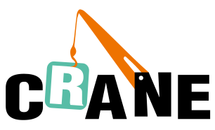

# Crane: Cloud Resource Analytics and Economics

---

Crane (FinOps Crane) is a cloud native open source project which manages cloud resources on Kubernetes stack, it is inspired by FinOps concepts.

## Introduction

The goal of Crane is to provide a one-stop-shop project to help Kubernetes users to save cloud resource usage with a rich set of functionalities:

- **Time Series Prediction** based on monitoring data
- **Usage and Cost visibility**
- **Usage & Cost Optimization** including:
  - R2 (Resource Re-allocation)
  - R3 (Request & Replicas Recommendation)
  - Effective Pod Autoscaling (Effective Horizontal & Vertical Pod Autoscaling)
  - Cost Optimization
- **Enhanced QoS** based on Pod PriorityClass
- **Load-aware Scheduling** 

## Getting Started

- [Introduction](https://docs.gocrane.io)
- [Installation](https://docs.gocrane.io/dev/installation/)
- [Tutorials](https://docs.gocrane.io/dev/tutorials/using-effective-hpa-to-scaling-with-effectiveness/)

## Documentation

Full documentation is available on the [Crane website](https://docs.gocrane.io).

## Community

- Wechat Group (Chinese): Add it and Reply "Crane"，Robot will add you in Wechat group.

- Bi-weekly Community Call(APAC, Chinese)
  - [Meeting Link](https://meeting.tencent.com/dm/SjY20wCJHy5F)
  - [Meeting Notes](https://doc.weixin.qq.com/doc/w3_AHMAlwa_AFU7PT58rVhTFKXV0maR6?scode=AJEAIQdfAAo0gvbrCIAHMAlwa_AFU)
  - [Video Records](https://www.wolai.com/33xC4HB1JXCCH1x8umfioS)

## RoadMap

Please see [this document](./docs/roadmaps/roadmap-2022.md) to learn more.

## Contributing

Contributors are welcomed to join Crane project. Please check [CONTRIBUTING](./CONTRIBUTING.md) about how to contribute to this project.

## Code of Conduct

Crane adopts [CNCF Code of Conduct](https://github.com/cncf/foundation/blob/master/code-of-conduct.md).
