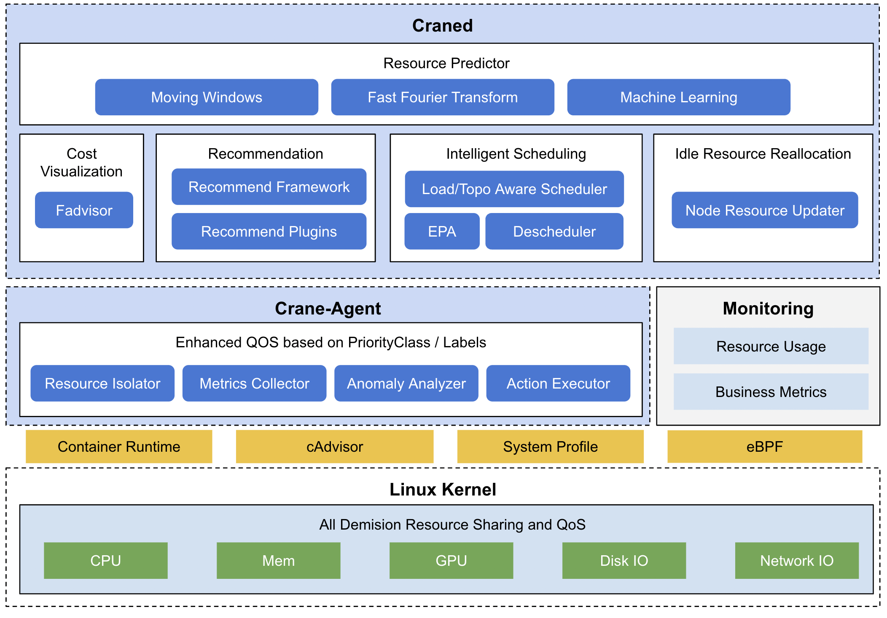

# Crane: Cloud Resource Analytics and Economics

---

## What is Crane

> English | [中文](README_zh.md)

Crane is a FinOps Platform for Cloud Resource Analytics and Economics in Kubernetes clusters. The goal is not only help user to manage cloud cost easier but also ensure the quality of applications.

**How to start a Cost-Saving journey on Crane?**

1. **Understanding**: Cost insight for cloud assets and kubernetes resources(Deployments, StatefulSets).
2. **Analytics**: Periodically analytics the states in cluster and provide optimization recommendations.
3. **Optimization**: Rich set of functionalities to operate and reduce your cost.

https://user-images.githubusercontent.com/35299017/186680122-d7756b47-06be-44cb-8553-1957eaa3ed45.mp4

**Live Demo** for Crane Dashboard: http://dashboard.gocrane.io/

## Main Features

**Cost Visualization and Optimization Evaluation**

- Provides a collection of exporters which collect cloud resource pricing and billing data and ship to your monitoring system like Prometheus.
- Multi-dimensional cost insight, optimization evaluates are supported. Support Multi-cloud Pricing through `Cloud Provider`。

**Recommendation Framework**

Provide a pluggable framework for analytics and give recommendation for cloud resources, support out-of-box recommenders: Workload Resources/Replicas, Idle Resources. [learn more](https://gocrane.io/docs/tutorials/recommendation/).

**Prediction-driven Horizontal Autoscaling**

EffectiveHorizontalPodAutoscaler supports prediction-driven autoscaling. With this capability, user can forecast the incoming peak flow and scale up their application ahead, also user can know when the peak flow will end and scale down their application gracefully. [learn more](https://gocrane.io/docs/tutorials/using-effective-hpa-to-scaling-with-effectiveness/).

**Load-Aware Scheduling**

Provide a simple but efficient scheduler that schedule pods based on actual node utilization data，and filters out those nodes with high load to balance the cluster. [learn more](https://gocrane.io/docs/tutorials/scheduling-pods-based-on-actual-node-load/).

**Colocation with Enhanced QoS**

## Architecture

The overall architecture of Crane is shown as below:

**Craned** 

Craned is the core component which manage the lifecycle of CRDs and APIs. It's deployed by a `Deployment` which consists of two container: 
- Craned: Operators for management CRDs, WebApi for Dashboard, Predictors that provide query TimeSeries API.
- Dashboard: Web component that built from TDesign's Starter, provide an easy-to-use UI for crane users.

**Fadvisor**

Fadvisor provides a collection of exporters which collect cloud resource pricing and billing data and ship to your monitoring system like Prometheus. Fadvisor support Multi-Cloud Pricing API by `Cloud Provider`. 

**Metric Adapter**

Metric Adapter implements a `Custom Metric Apiserver`. Metric Adapter consume Crane CRDs and provide HPA Metrics by `Custom/External Metric API`.

**Crane Agent**

Crane Agent is a `DaemonSet` that runs in each node.

## Getting Started

- [Introduction](https://gocrane.io/docs/getting-started/introduction/)
- [Quick Start](https://gocrane.io/docs/getting-started/quick-start/)
- [Tutorials](https://gocrane.io/docs/tutorials/)

## Documentation

Full documentation is available on the [Crane website](https://gocrane.io).

## Community

- Slack(English): [https://gocrane.slack.com](https://join.slack.com/t/gocrane/shared_invite/zt-1ehm9871y-Zgs5pXxSIhYg5hGSc5XZgQ)

- Wechat Group (Chinese): Add it and Reply "Crane"，Robot will add you in Wechat group.

- Bi-weekly Community Call(APAC, Chinese)
  - [Meeting Link](https://meeting.tencent.com/dm/SjY20wCJHy5F)
  - [Meeting Notes](https://doc.weixin.qq.com/doc/w3_AHMAlwa_AFU7PT58rVhTFKXV0maR6?scode=AJEAIQdfAAo0gvbrCIAHMAlwa_AFU)
  - [Video Records](https://www.wolai.com/33xC4HB1JXCCH1x8umfioS)

## RoadMap

Please see [this document](./docs/roadmaps/roadmap-2022.md) to learn more.

## Contributing

Contributors are welcomed to join Crane project. Please check [CONTRIBUTING](./CONTRIBUTING.md) about how to contribute to this project.

For how to start develop for Crane, you can check [developer's documentation](./docs/developer-guide.md).

## Code of Conduct

Crane adopts [CNCF Code of Conduct](https://github.com/cncf/foundation/blob/master/code-of-conduct.md).

