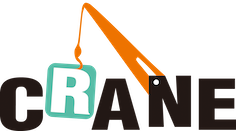

# Crane: Cloud Resource Analytics and Economics

---

- [Crane: Cloud Resource Analytics and Economics](#crane-cloud-resource-analytics-and-economics)
  - [Architecture](#architecture)
  - [Components](#components)
    - [Predictor](#predictor)
    - [Effective Horizontal Pod Autoscaler](#effective-horizontal-pod-autoscaler)
    - [Analysis](#analysis)
    - [Ensurance](#ensurance)

## Architecture

Crane (FinOps Crane) is an opensource project which manages cloud resource on Kubernetes stack, it is inspired by FinOps concepts.
Goal of Crane is to provide an one-stop shop project to help Kubernetes users to save cloud resource usage with a rich set of functionalities:

- Resource Metrics Prediction based on monitoring data
- Cost visibility including:
  - Cost allocation, cost and usage virtualization
  - Waste identification
  - Idle resource collection and reallocation
- Usage & Cost Optimization including:
  - Enhanced scheduling which optimized for better resource utilization
  - Intelligent Scaling based on prediction result
  - Cost Optimization based on better billing rate
- QoS Ensurance based on Pod PriorityClass

## Components

### Predictor

---

Knowing the future makes things easier for us.

---

Many businesses are naturally cyclical in time series, especially for those that directly or indirectly serve "people". This periodicity is determined by the regularity of people’s daily activities. For example, people are accustomed to ordering take-out at noon and in the evenings; there are always traffic peaks in the morning and evening; even for services that don't have such obvious patterns, such as searching, the amount of requests at night is much lower than that during business hours. For applications related to this kind of business, it is a natural idea to infer the next day's metrics from the history data of the past few days, or to infer the coming Monday's access traffic from the data of last Monday. With predicted metrics or traffic patterns in the next 24 hours, we can better manage our application instances, stabilize our system, and meanwhile, reduce the cost.

Crane predictor fetches historical metric data for the monitoring system, such as Prometheus, and identifies the time series that are predictable, for example, system cpu load, memory footprint, application's user traffic, etc. Then it outputs the prediction results, which can be consumed by other crane components, like [Effective Horizontal Pod Autoscaler](#effective-horizontal-pod-autoscaler) and [Analysis](#analysis). It's also straightforward to apply the prediction results in user's applications.

### Effective Horizontal Pod Autoscaler

EHPA is an application that is built on [Predictor](#predictor). It takes advantage of the native [HPA](https://kubernetes.io/docs/tasks/run-application/horizontal-pod-autoscale/) mechanism, but it is based on prediction and scales applications in advance actively rather than reacting to monitoring metrics passively. Comparing with native HPA, advanced-horizontal-pod-autoscaler eliminates manual configuration and autoscaling lag and so it enhances HPA in terms of

- Reliability -- Guarantee both scalability and availability
- Responsiveness -- Scale up fast enough to successfully handle the increase in workload
- Efficiency -- Reduce the cost

Please see [this document](./docs/tutorials/using-effective-hpa-to-scaling-with-effectiveness.md) to learn how to use EHPA.

### Analysis

### Ensurance
