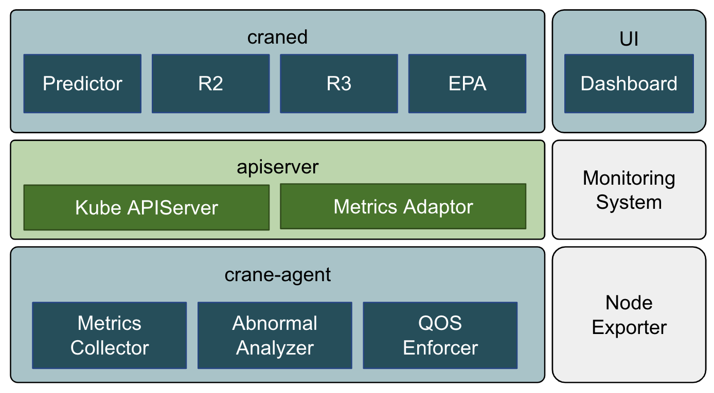

# Crane: Cloud Resource Analytics and Economics

[](https://goreportcard.com/report/github.com/gocrane/crane)
[](https://godoc.org/github.com/gocrane/crane)
[](https://www.apache.org/licenses/LICENSE-2.0.html)


---

Crane (FinOps Crane) is a cloud native open source project which manages cloud resources on Kubernetes stack, it is inspired by FinOps concepts.

- [Crane: Cloud Resource Analytics and Economics](#crane-cloud-resource-analytics-and-economics)
  - [Introduction](#introduction)
  - [Features](#features)
    - [TimeSeriesPrediction](#Time-series-prediction)
    - [Effective HorizontalPodAutoscaler](#effective-horizontalpodautoscaler)
    - [Analytics](#analytics)
    - [QoS Ensurance](#qos-ensurance)
  - [Repositories](#repositories)
  - [Getting Started](#getting-started)

## Introduction

The goal of Crane is to provide a one-stop-shop project to help Kubernetes users to save cloud resource usage with a rich set of functionalities:

- **Time Series Prediction** based on monitoring data
- **Usage and Cost visibility**
- **Usage & Cost Optimization** including:
  - R2 (Resource Re-allocation)
  - R3 (Request & Replicas Recommendation)
  - Effective Pod Autoscaling (Effective Horizontal & Vertical Pod Autoscaling)
  - Cost Optimization
- **Enhanced QoS** based on Pod PriorityClass



## Features
### Time Series Prediction

Crane predictor fetches metric data, and then outputs the prediction results.
The prediction result can be consumed by other crane components, like [EHPA](#effective-horizontalpodautoscaler) and [Analytics](#analytics).

Please see [this document](./docs/tutorials/using-time-series-prediction.md) to learn more.

### Effective HorizontalPodAutoscaler

EffectiveHorizontalPodAutoscaler helps you manage application scaling in an easy way. It is compatible with native [HorizontalPodAutoscaler](https://kubernetes.io/docs/tasks/run-application/horizontal-pod-autoscale/) but extends more features like prediction-driven autoscaling.

Please see [this document](./docs/tutorials/using-effective-hpa-to-scaling-with-effectiveness.md) to learn more.

### Analytics

Analytics model analyzes the workload and provide recommendations about resource optimize.

Two Recommendations are currently supported:
- **ResourceRecommend**: Recommend container requests & limit resources based on historic metrics.
- **Effective HPARecommend**: Recommend which workloads are suitable for autoscaling and provide optimized configurations such as minReplicas, maxReplicas.

### QoS Ensurance

## Repositories

Crane is composed of the following components:
- [craned](cmd/craned). - main crane control plane.
  - **Predictor** - Predicts resources metrics trends based on historical data.
  - **AnalyticsController** - Analyzes resources and generate related recommendations.
  - **RecommendationController** - Recommend Pod resource requests and autoscaler.
  - **NodeResourceController** - Re-allocate node resource based on prediction result.
  - **EffectiveHPAController** - Effective HPA based on prediction result.
- [metric-adaptor](cmd/metric-adapter). - Metric server for driving the scaling.
- [crane-agent](cmd/crane-agent). - Ensure critical workloads SLO based on abnormally detection.
- [gocrane/api](https://github.com/gocrane/api). This repository defines component-level APIs for the Crane platform.
- [gocrane/fadvisor](https://github.com/gocrane/fadvisor) Financial advisor which collect resource prices from cloud API. 

## Getting Started

### Prerequisites

- Kubernetes 1.18+
- Helm 3.1.0

### Installation

#### Installing prometheus components with helm chart

> Note:
> If you already deployed prometheus, kube-state-metric, prometheus-node-exporter, then you can skip this step.

Crane use prometheus to be the default metric provider. Using following command to install prometheus with the release name `[RELEASE_NAME]`. It will also install dependent chart: kube-state-metric.

```console
helm repo add prometheus-community https://prometheus-community.github.io/helm-charts
helm repo update
helm install [RELEASE_NAME] -n [NAMESPACE] --create-namespace  prometheus-community/prometheus
```

Using following command to install prometheus-node-exporter with another release name `[NODE_EXPORTER_RELEASE_NAME]`.

```console
helm install [NODE_EXPORTER_RELEASE_NAME] -n [NAMESPACE] --create-namespace  prometheus-community/prometheus-node-exporter
```

#### Configure Prometheus Address

The following command will configure your prometheus http address for crane, please change `YOUR_PROMETHEUS` to actual Prometheus address. If you're following above guide to install prometheus with helm chart then **YOUR_PROMETHEUS** would be: `http:\/\/[RELEASE_NAME]-prometheus-server.[NAMESPACE].svc.cluster.local`

```console
PROMETHEUS_ADDRESS="YOUR_PROMETHEUS" && sed -i '' "s/PROMETHEUS_ADDRESS/${YOUR_ADDRESS}/" deploy/craned/deployment.yaml
```

#### Deploying Crane

You can deploy `Crane` by apply YAML declaration.

```console
kubectl apply -f deploy/manifests 
kubectl apply -f deploy/craned 
kubectl apply -f deploy/metric-adapter
```

#### Deploying Crane-agent

If you want to try `QoS Ensurance`, then deploy `Crane-agent` by apply YAML declaration which will create a DaemonSet in your cluster.

```console
kubectl apply -f deploy/crane-agent 
```
