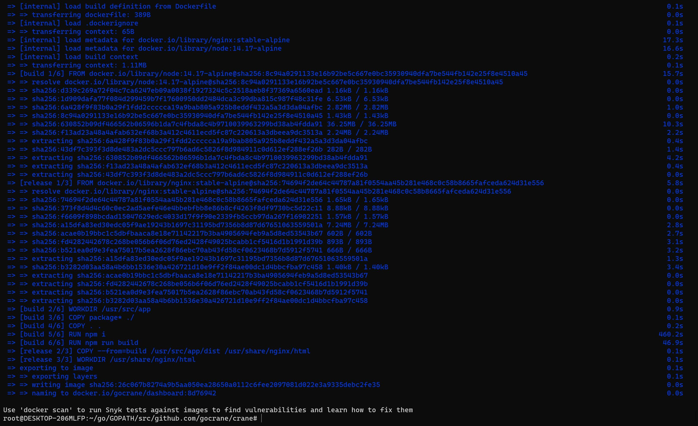

First, please make sure you've got a working [Go environment](https://golang.org/doc/install)
and [Docker environment](https://docs.docker.com/engine).

## Clone crane

Clone the repository,

```bash
mkdir -p $GOPATH/src/github.com/gocrane/
cd $GOPATH/src/github.com/gocrane/
git clone https://github.com/gocrane/crane.git
cd crane
```

## Building Binaries

Run

```bash
# build for linux/amd64 by default
make all
```

to build binaries `craned`, `crane-agent` and `metric-adapter` for `linux/amd64`.


Also you could specify other platforms when building, such as,

```bash
# build only crane-agent for linux/arm64 and darwin/amd64
# use comma to separate multiple platforms
PLATFORMS=linux/arm64,darwin/amd64 make crane-agent
# below are all the supported platforms
# PLATFORMS=darwin/amd64,darwin/arm64,linux/amd64,linux/arm64,linux/ppc64le,linux/s390x,linux/386,linux/arm
```

All the built binaries will be placed at `$GOPATH/src/github.com/gocrane/crane/bin` folder.


## Building Docker Images

You can also build docker images. Here `docker buildx` is used to help build multi-arch container images.

If you're running MacOS, please install [Docker Desktop](https://docs.docker.com/desktop/) and then check the builder,

```bash
$ docker buildx ls
NAME/NODE DRIVER/ENDPOINT STATUS  PLATFORMS
default * docker
  default default         running linux/amd64, linux/arm64, linux/ppc64le, linux/s390x, linux/386, linux/arm/v7, linux/arm/v6
```

If you're running Linux, please refer to [docker buildx docs](https://docs.docker.com/buildx/working-with-buildx/)
on the installation.

!!! note
    For better `docker buildx` support, it is recommended to use Ubuntu Focal 20.04 (LTS), Debian Bullseye 11 and CentOS 8.
    And install deb/rpm package `qemu-user-static` as well, such as

    ```bash
    apt-get install qemu-user-static
    ```
    
    or

    ```bash
    yum install qemu-user-static
    ```

    ```bash
    # build for linux/amd64 by default
    # container images for craned, crane-agent, metric-adapter and dashboard
    make images
    ```




Also you could build container images for other platforms, such as `arm64`,

```bash
PLATFORMS=linux/amd64,linux/arm64,linux/ppc64le make images
# below are all the supported platforms
# PLATFORMS=linux/amd64,linux/arm64,linux/ppc64le,linux/s390x,linux/386,linux/arm
```

!!! note
    For the first make image, It takes a bit of a long time, Please be patient.

When we finish the make image, in the docker desktop, we can see the image we built, and the Tag is the hash value at the time of the git commit.


