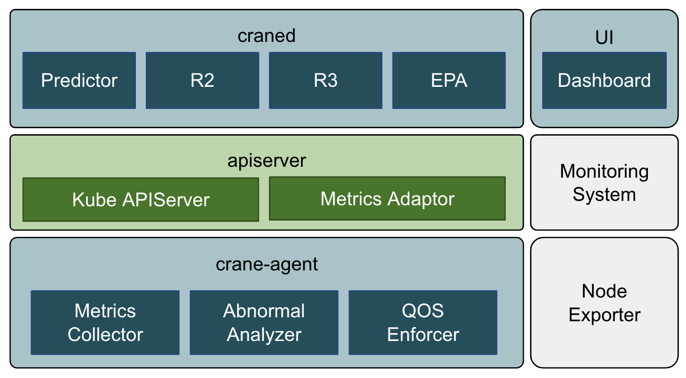

# Introduction

The goal of Crane is to provide a one-stop-shop project to help Kubernetes users to save cloud resource usage with a rich set of functionalities:

- **Time Series Prediction** based on monitoring data
- **Usage and Cost visibility**
- **Usage & Cost Optimization** including:
    - R2 (Resource Re-allocation)
    - R3 (Request & Replicas Recommendation)
    - Effective Pod Autoscaling (Effective Horizontal & Vertical Pod Autoscaling)
    - Cost Optimization
- **Enhanced QoS** based on Pod PriorityClass
- **Load-aware Scheduling** 

## Features
### Time Series Prediction

TimeSeriesPrediction defines metric spec to predict kubernetes resources like Pod or Node.
The prediction module is the core component that other crane components relied on, like [EHPA](#effective-horizontalpodautoscaler) and [Analytics](#analytics).

Please see [this document](tutorials/using-time-series-prediction.md) to learn more.

### Effective HorizontalPodAutoscaler

EffectiveHorizontalPodAutoscaler helps you manage application scaling in an easy way. It is compatible with native [HorizontalPodAutoscaler](https://kubernetes.io/docs/tasks/run-application/horizontal-pod-autoscale/) but extends more features like prediction-driven autoscaling.

Please see [this document](tutorials/using-effective-hpa-to-scaling-with-effectiveness.md) to learn more.

### Analytics

Analytics model analyzes the workload and provide recommendations about resource optimize.

Two Recommendations are currently supported:

- **ResourceRecommend**: Recommend container requests & limit resources based on historic metrics.
- **Effective HPARecommend**: Recommend which workloads are suitable for autoscaling and provide optimized configurations such as minReplicas, maxReplicas.

### QoS Ensurance
Kubernetes is capable of starting multiple pods on same node, and as a result, some of the user applications may be impacted when there are resources(e.g. cpu) consumption competition. To mitigate this, Crane allows users defining PrioirtyClass for the pods and QoSEnsurancePolicy, and then detects disruption and ensure the high priority pods not being impacted by resource competition.

Avoidance Actions:

- **Disable Schedule**: disable scheduling by setting node taint and condition
- **Throttle**: throttle the low priority pods by squeezing cgroup settings
- **Evict**: evict low priority pods

Please see [this document](tutorials/using-qos-ensurance.md) to learn more.

## Load-aware Scheduling
Native scheduler of kubernetes can only schedule pods by resource request, which can easily cause a series of load uneven problems. In contrast, Crane-scheduler can get the actual load of kubernetes nodes from Prometheus, and achieve more efficient scheduling.

Please see [this document](tutorials/scheduling-pods-based-on-actual-node-load.md) to learn more.

## Repositories

Crane is composed of the following components:

- [craned](https://github.com/gocrane/crane/tree/main/cmd/craned) - main crane control plane.
    - **Predictor** - Predicts resources metrics trends based on historical data.
    - **AnalyticsController** - Analyzes resources and generate related recommendations.
    - **RecommendationController** - Recommend Pod resource requests and autoscaler.
    - **ClusterNodePredictionController** - Create Predictor for nodes.
    - **EffectiveHPAController** - Effective HPA for horizontal scaling.
    - **EffectiveVPAController** - Effective VPA for vertical scaling.
- [metric-adaptor](https://github.com/gocrane/crane/tree/main/cmd/metric-adapter) - Metric server for driving the scaling.
- [crane-agent](https://github.com/gocrane/crane/tree/main/cmd/crane-agent) - Ensure critical workloads SLO based on abnormally detection.
- [gocrane/api](https://github.com/gocrane/api) - This repository defines component-level APIs for the Crane platform.
- [gocrane/fadvisor](https://github.com/gocrane/fadvisor) - Financial advisor which collect resource prices from cloud API.
- [gocrane/crane-scheduler](https://github.com/gocrane/crane-scheduler) - A Kubernetes scheduler which can schedule pod based on actual node load.
