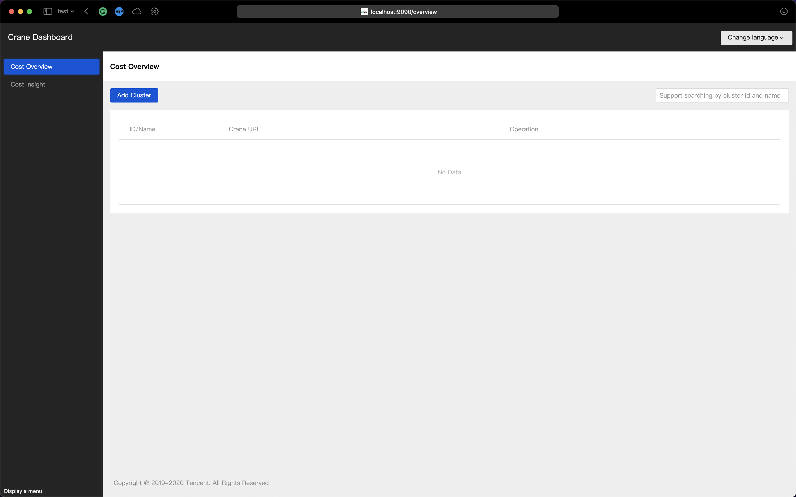
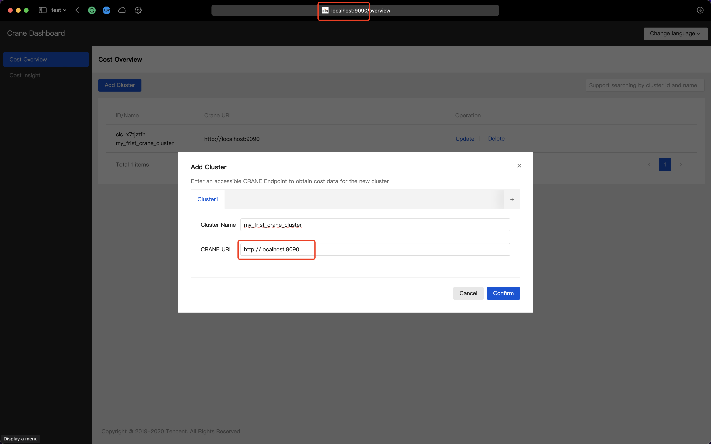

# 產品部署指南

為了讓您更快的部署 Crane ，本文檔提供清晰的：

* 部署環境要求
* 具體安裝步驟

Crane 安裝時間在10分鐘左右，具體時間也依賴集群規模以及硬件能力。目前安裝已經非常成熟，如果您安裝中遇到任何問題，可以採取如下幾種方式：

* 請首先檢查後文的 F&Q
* 可以提出一個 [Issue](https://github.com/gocrane/crane/issues/new?assignees=&labels=kind%2Fbug&template=bug_report.md&title=)，我們會認真對待每一個 [Issue](https://github.com/gocrane/crane/issues)

## 部署環境要求

- Kubernetes 1.18+
- Helm 3.1.0

## 安裝流程

### 安裝 Helm

建議參考 Helm 官網[安裝文檔](https://helm.sh/docs/intro/install/)。

### 安裝 Prometheus 和 Grafana

使用 Helm 安裝 Prometheus 和 Grafana。

!!! Note "注意" 
    如果您已經在環境中部署了 Prometheus 和 Grafana，可以跳過該步驟。

!!! Warning "網絡問題"
    如果你的網絡無法訪問GitHub資源(GitHub Release, GitHub Raw Content `raw.githubusercontent.com`)。
    
    那麼你可以嘗試鏡像倉庫。但鏡像倉庫具有一定的**時延**。 [鏡像倉庫](mirror.zh.md)


Crane 使用 Prometheus 抓取集群工作負載對資源的使用情況。安裝 Prometheus：

=== "Main"

    ```bash
    helm repo add prometheus-community https://prometheus-community.github.io/helm-charts
    helm install prometheus -n crane-system \
                            --set prometheus-pushgateway.enabled=false \
                            --set alertmanager.enabled=false \
                            --set server.persistentVolume.enabled=false \
                            -f https://raw.githubusercontent.com/gocrane/helm-charts/main/integration/prometheus/override_values.yaml \
                            --create-namespace  prometheus-community/prometheus
    ```

=== "Mirror"

    ```bash
    helm repo add prometheus-community https://finops-helm.pkg.coding.net/gocrane/prometheus-community
    helm install prometheus -n crane-system \
                            --set prometheus-pushgateway.enabled=false \
                            --set alertmanager.enabled=false \
                            --set server.persistentVolume.enabled=false \
                            -f https://finops.coding.net/p/gocrane/d/helm-charts/git/raw/main/integration/prometheus/override_values.yaml?download=false \
                            --create-namespace  prometheus-community/prometheus
    ```


Crane 的 Fadvisor 使用 Grafana 展示成本預估。安裝 Grafana：

=== "Main"

    ```bash
    helm repo add grafana https://grafana.github.io/helm-charts
    helm install grafana \
                 -f https://raw.githubusercontent.com/gocrane/helm-charts/main/integration/grafana/override_values.yaml \
                 -n crane-system \
                 --create-namespace grafana/grafana
    ```

=== "Mirror"

    ```bash
    helm repo add grafana https://finops-helm.pkg.coding.net/gocrane/grafana
    helm install grafana \
                 -f https://finops.coding.net/p/gocrane/d/helm-charts/git/raw/main/integration/grafana/override_values.yaml?download=false \
                 -n crane-system \
                 --create-namespace grafana/grafana
    ```

### 安裝 Crane 和 Fadvisor

=== "Main"

    ```bash
    helm repo add crane https://gocrane.github.io/helm-charts
    helm install crane -n crane-system --create-namespace crane/crane
    helm install fadvisor -n crane-system --create-namespace crane/fadvisor
    ```

=== "Mirror"

    ```bash
    helm repo add crane https://finops-helm.pkg.coding.net/gocrane/gocrane
    helm install crane -n crane-system --create-namespace crane/crane
    helm install fadvisor -n crane-system --create-namespace crane/fadvisor
    ```

### 安裝 Crane-scheduler（可選）
```console
helm install scheduler -n crane-system --create-namespace crane/scheduler
```

## 驗證安裝是否成功

使用如下命令檢查安裝的 Deployment 是否正常：

```console
kubectl get deploy -n crane-system
```

結果類似如下：

```shell
NAME                            READY   UP-TO-DATE   AVAILABLE   AGE
craned                          1/1     1            1           31m
fadvisor                        1/1     1            1           41m
grafana                         1/1     1            1           42m
metric-adapter                  1/1     1            1           31m
prometheus-kube-state-metrics   1/1     1            1           43m
prometheus-server               1/1     1            1           43m
```

可以查看本篇[文檔](https://github.com/gocrane/helm-charts/blob/main/charts/crane/README.md)獲取更多有關 Crane Helm Chart 的信息。

## 成本展示

### 打開 Crane 控制台

注意：Crane 的控制台地址就是 Crane 的 URL 地址，可以將其添加到統一的控制台查看多個部署 Crane 的集群的信息。

利用 [Port forwarding](https://kubernetes.io/docs/tasks/access-application-cluster/port-forward-access-application-cluster/) 命令，可以在本地計算機的瀏覽器打開 Crane 控制台：

```
kubectl port-forward -n crane-system svc/craned 9090
```

執行上述命令後，不要關閉命令行工具，在本地計算機的瀏覽器地址裡輸入 `localhost:9090`即可打開 Crane 的控制台：



### 添加安裝了 Crane 的集群

您可以點擊上圖中的“添加集群”的藍色按鈕，將 Crane 控制台的地址 `http://localhost:9090` 作為 Crane 的 URL，作為第一個集群添加到 Crane 控制台。



若您想添加其它集群，實現多集群的資源使用和成本分析。可以在別的集群中也安裝完 Crane 之後，將 Crane 的 URL 添加進來。

## 自定義安裝

通過 YAML 安裝 `Crane` 。

=== "Main"

    ```bash
    git clone https://github.com/gocrane/crane.git
    CRANE_LATEST_VERSION=$(curl -s https://api.github.com/repos/gocrane/crane/releases/latest | grep -oP '"tag_name": "\K(.*)(?=")')
    git checkout $CRANE_LATEST_