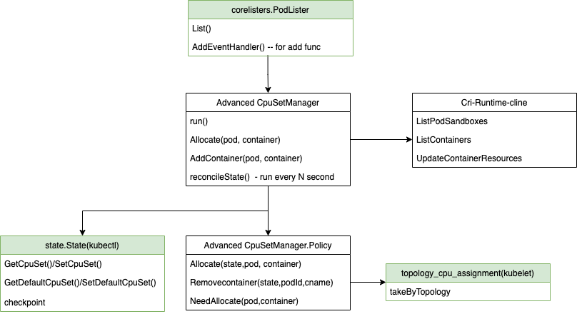

# Advanced CPUSet Manager
- Static CPU manager is supported by kubelet, when a guaranteed Pod is running on a node, kubelet allocate specific cpu cores to the processes exclusively, which generally keeps the cpu utilization of the node low.
This proposal provides a new mechanism to manage cpusets, which allows sharing cpu cores with other processes while binds cpuset.It also allows to revise cpuset when pod is running and relaxes restrictions of binding cpus in kubelet.

## Table of Contents

<!-- TOC -->

- [Advanced CPUSet Manager](#advanced-cpuset-manager)
    - [Table of Contents](#table-of-contents)
    - [Motivation](#motivation)
        - [Goals](#goals)
        - [Non-Goals/Future Work](#non-goalsfuture-work)
    - [Proposal](#proposal)
        - [Relax restrictions of cpuset allocation](#relax-restrictions-of-cpuset-allocation)
        - [Add new annotation to describe the  requirement of cpuset contorl manger](#add-new-annotation-to-describe-the--requirement-of-cpuset-contorl-manger)
        - [Advanced CPU Manager component](#advanced-cpu-manager-component)
        - [User Stories](#user-stories)
            - [Story 1](#story-1)
            - [Story 2](#story-2)
        - [Risks and Mitigations](#risks-and-mitigations)

<!-- /TOC -->
## Motivation
Some latency-sensitive applications have lower lantency and cpu usage when running with specific cores, which results in fewer context switchs and higer cache affinity.
But kubelet will always exclude assigned cores in shared cores, which may waste resources.Offline and other online pods can running on the cores actually. In our experiment, for the most part, it is barely noticeable for performance of service.

### Goals

- Provide a new mechanism to manage cpuset bypass
- Provide a new cpuset manager method "shared"
- Allow revise cpuset when pod running
- Relax restrictions of binding cpus


### Non-Goals/Future Work

- Solve the conflicts with kubelet static cpuset manager, you need to set kubelet cpuset manager to "none"
- Numa manager will support in future, CCX/CCD manager also be considered

## Proposal
### Relax restrictions of cpuset allocation
Kubelet allocate cpus for containers should meet the conditions:

1. requests and limits are specified for all the containers and they are equal

2. the container's resource limit for the limit of CPU is an integer greater than or equal to one and equal to request request of CPU.

In Crane, only need to meet condition No.2
### Add new annotation to describe the  requirement of cpuset contorl manger
```yaml
apiVersion: v1
kind: Pod
metadata:
  annotations:
    qos.gocrane.io/cpu-manager: none/exclusive/share
```
Provide three polices for cpuset manager:
- none: containers of this pod shares a set of cpus which not allocated to exclusive containers
- exclusive:  containers of this pod monopolize the allocated CPUs , other containers not allowed to use.
- share: containers of this pod runs in theallocated  CPUs , but other containers can also use.

### Advanced CPU Manager component


- Crane-agent use podLister informs to sense the creation of pod.
- Crane-agent allocate cpus when pod is binded, and loop in cycle to addContainer(change cpuset) until the containers are created
- Update/Delete pod will handle in reconcile state.
- state.State referenced from kubelet and topology_cpu_assignment copied from kubelet


### User Stories

- Users can update pod annotaion to control cpuset policy flexibly

#### Story 1
  make pod from none to share without recreating pod
#### Story 2
  make pod from exclusive to share, so offline process can use these CPUs

### Risks and Mitigations

- kubelet cpu manger policy need to be set to none, otherwise will be conflicted with crane-agent
- if crane-agent can not allocate CPUs for pods, it will not refuse to start pod as kubelet

