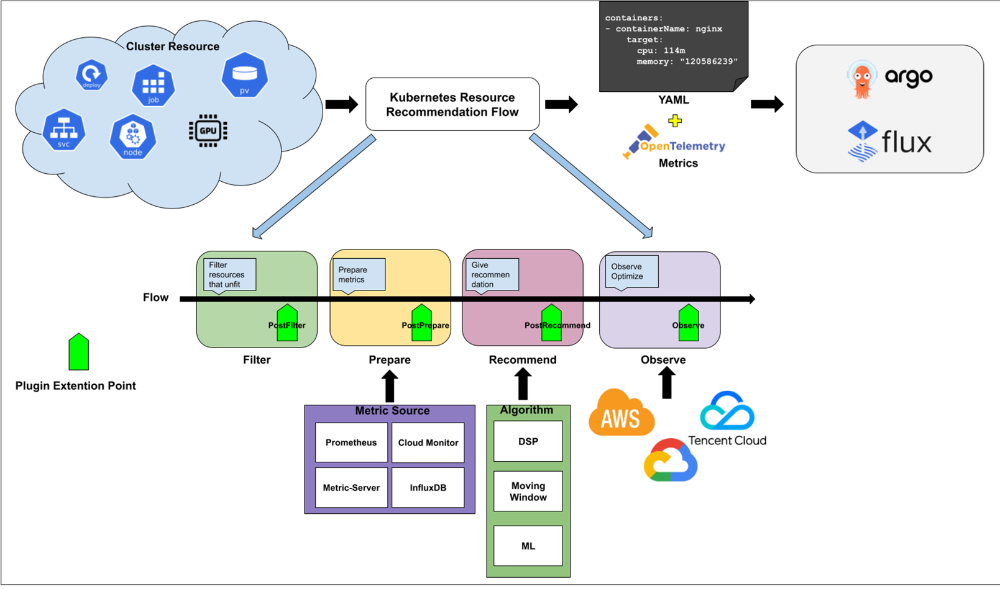

# Universal Resource Optimization 
- Universal Resource Optimization provide a consistence progress to optimize variable kinds of resources in kubernetes. The progress should be Pluggable and support Multi-Cloud.

## Table of Contents

<!-- TOC -->

<!-- /TOC -->
## Motivation
Currently, we use `Analytics` and `Recommendation` to provide a recommendation service for workloads in cluster. Kubernetes' users use the recommendation to optimize the resource configuration and reduce their cost.
But the recommendations have some limitations now:

1. Multiple Analytics can select some same resources, it's confused and unnecessary to have two recommendation for the same resource. 
2. We need to support more kinds of resources, for example, scan for idle load balancers.
3. We need to make the progress Pluggable to support different user in difference clouds.

### Goals

- Global analytics rules
- Easy to know the recommendation for my resource
- Consistence progress for all resource recommendation
- Plugin mechanism to support Multi-Cloud

### Non-Goals

- Cloud Resources that are not managed by kubernetes

## Proposal

### Recommendation Definition

Recommendation Definition discuss data model about the recommendation process.  It answers following questions:

- How to define what resources need to be recommended
- How to know the suggested advice for my resource
- How to config the recommender which have different function for different resources

### Recommendation Framework

Recommendation Framework provide a pluggable mechanism that let user extend the default recommender.

### User Stories

#### Story 1
  As a Serverless customer, I want to know the suitable requests and limits for my deployments, the result should be fit the existing pod model(e.g. 2c4g, 1c1g) in my cloud production.
#### Story 2
  As an Aliyun ACK customer, I want to know whether there is a waste of LoadBalances in my cluster and delete them if exists.  
#### Story 3
  As a container platform user, I want to integrate optimize recommendation to my platform and optimize my cluster within my CICD pipeline.

