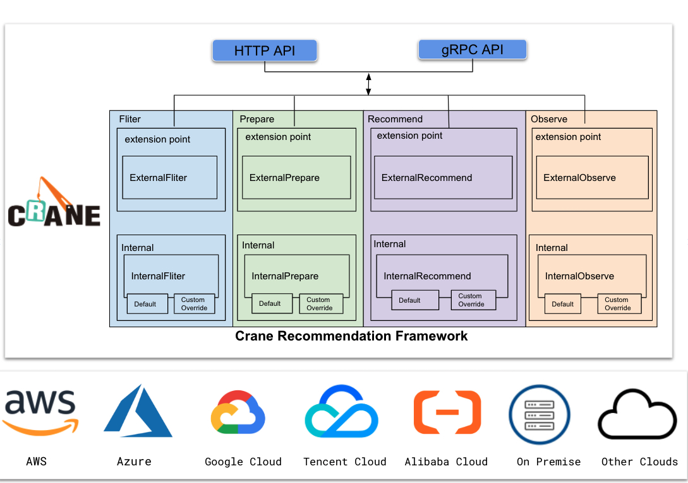

# Recommendation Framework Internal

## Summary

This document describes the Crane Recommendation Framework Internal. We will propose the four major modules of Crane Recommendation in this proposal. By clearly dividing the functions of the modules and defining the interface, developers can expand the recommendation more conveniently and flexibly.

## Motivation

At present, crane Recommendation has been applied to kubernetes resource fields such as resource recommendation, replica recommendation, HPA recommendation, etc. The algorithm modules of crane, such as DSP, Max and Percentile algorithm modules, have been verified to be stable and effective in production practice.At the same time, the offline data source of crane supports prometheus, grpc protocol service, and the online data source supports prometheus and metricsserver. However, we have received a lot of feedback from developers, mainly focusing on the following aspects:

1. After I have defined many different Recommendation types, I want to add some filtering or inject logic, but there seems to be no such interface.
2. Our monitoring system is not in the default implementation, how can I implement a custom interface so that my resources can also use crane's recommended optimization capabilities?
3. We found that the crane algorithm is not very effective for our business type, but we have explored some effective algorithms before, how to connect to the crane system?
4. We want to be able to interface directly to the billing system after cost optimization, so we can directly quantify how much money is saved.

In order to solve the above problems, we hope the whole recommendation process is more open and flexible. Therefore, we propose the crane recommendation framework, which will be divided into two types. The first is to implement recommendation flow logic in crane core code, and the second is out-of-tree, you need to implement extension point through http request or gRPC call. This documentation will focus on the first implementation type.

## Goals

- Define the architecture of Recommendation Framework.
- Define the interfaces of Recommendation Framework Internal modules.

## Non-Goals

- Define the interfaces of Recommendation Framework Extender.
- Provide specific implementation examples for each module of framework.

## Proposal

### Architecture

### Phases

We divide the whole recommendation process into four actions, Fliter, Prepare, Recommend, Observe. The input of the whole system is the kubernetes resource you want to analyze, and the output is the best recommendation for the resource.Below we describe in detail the capabilities and input and output of each part of Recommendation Framework.

#### Fliter

The input of Fliter is an analysis recommendation task queue, and the queue stores the Recommendation CR submitted by the user.In default PreFliter,we will do nothing for the queue, this queue will be a FIFO queue.If you want to follow certain rules for the queue, you can implement it yourself PreFliter via extension point or override this func.In the default fliter stage, we will first filter the non-recommended resources according to the user-defined analyzable resource type. For example, the analyzable kubernetes resource I defined is deployment,ingress,node. If you submit a recommendation cr for statefulset, it will be abort in this phase.Then, we will check whether the resource you want exists, if not, we will abort.If you wish to use different filtering logic, you can implement your own logic through the fliter extension point or override it. 

#### Prepare

Prepare is the data preparation stage, and will pull the indicator sequence within the specified time according to your recommended tasks.In PrePrepare,by default we will check the connectivity of the metrics system. And we need generate the specified metrics information for metrics server system like prometheus or metrics server. In Prepare,we will get the indicator sequence information.In PostPrepare, we will implement a data processing module.Some data processing such as data correction for cold start application resource glitch, missing data padding, data aggregation,deduplication or noise reduction. The output of whole will be normalized to a specified data type.Of course you can also implement your own PrePrepare, Prepare, PostPrepare logic.

#### Recommend

The input of Recommend is a data sequence, and the output is the result of the recommendation type you specify. For example, if your recommendation type is resource, the output is the recommended size of the resource of the kubernetes workload you specified.In Recommend, we will apply crane's algorithm library to your data sequence.And in PostRecommend,We will use some strategies to regularize the results of the algorithm. For example, if a margin needs to be added when recommending resources, it will be processed at this stage.You can implement your own Recommend logic via extension points or override it.

#### Observe

Observe is to intuitively reflect the effectiveness of the recommendation results. For example, when making resource recommendations, users not only care about the recommended resource configuration, but also how much cost can be saved after modifying the resource configuration. In PreObserver, we will check the cloud api connectivity and establish link with cloud vendor's billing system. And in Observe we will turn resource optimization into cost optimization.You can implement your own Observe logic via extension points or override it.
