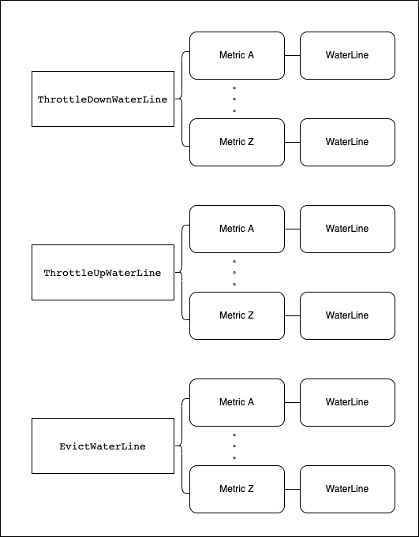
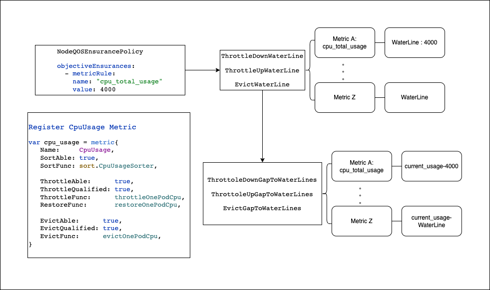

# Pod Sorting And Precise Execution For Crane Agent
The proposal enriches the sorting strategy of the crane agent and perfects the general sorting. In addition, a framework of precise operation (throttle/eviction) is implemented. When performing throttle, eviction and other operations, the precise operation logic of operating to the water level specified by the user, i.e. stopping, avoids excessive operation of low optimal pod;

Specifically:

- Enriches the sorting strategy of crane agent, and perfects the general sorting and CPU dimension sorting with CPU usage as the main reference;

- For CPU usage, the precise operation logic that stops when operating to the water level specified by the user when throttle/eviction is implemented, which avoids the excessive operation of low optimal pod;

- A framework of precise operation (throttle/eviction) is implemented. By improving some column attributes and implementation of user-defined indicators, it can also have the same precise operation ability as CPU usage without caring about specific details, and has certain universality and scalability.

## Table of Contents

<!-- TOC -->

- [Pod Sorting And Precise Execution For Crane Agent](#Pod Sorting And Precise Execution For Crane Agent)
    - [Table of Contents](#table-of-contents)
    - [Motivation](#motivation)
        - [Goals](#goals)
    - [Proposal](#proposal)
        - [Enrich the sorting strategy of pod](#Enrich the sorting strategy of pod)
        - [Definition of metric attribute](#Definition of metric attribute)
        - [How to control accurately according to the water level](#How to control accurately according to the water level)
        - [Precise operation of pod based on water level](#Precise operation of pod based on water level)
            - [Analyzer phase](#Analyzer phase)
            - [Executor phase](#Executor phase)
        - [Non-Goals/Future Work](#non-goalsfuture-work)
        - [User Stories](#user-stories)

<!-- /TOC -->
## Motivation
Currently, in the crane agent, when the water level specified in the NodeQosEnsurancePolicy is exceeded, perform throttle, eviction and other operations to sort the low priority pods first. The current sorting is based on the prority class of the pod, and then perform throttle or eviction on the sorted pods;

The existing problems are:

1. sorting only refers to prority class, which cannot meet the sorting based on other features; At the same time, it can not meet the requirements of flexible sequencing according to the precise operation of the water level line, and can not meet the requirements of making the nodes reach the specified water level as soon as possible. For example, when we want to reduce the CPU usage of low priority services as soon as possible, we should select the pod with more CPU usage, which can reduce the CPU usage faster and ensure that high-quality services are not affected.

2. after triggering the watermark specified in NodeQosEnsurancePolicy, all pods on the node that are lower than the specified prolityclass will be operated; For example, there are 10 pods on the current node that are lower than the specified prority class. After the water level is triggered, operations will be performed on all 10 pods. However, in fact, after the operation on the first pod is completed, it may be lower than the index value in NodeQosEnsurancePolicy. The operation on the remaining pods is excessive and can be avoided. If the index value in NodeQosEnsurancePolicy can be used as the watermark to accurately operate the pod, it is more appropriate to operate it just below the watermark, so as to avoid excessive impact on low priority services.

### Goals

- Enriches the sorting strategy of crane agent, including the sorting with pod CPU consumption as the main reference, the sorting with pod memory consumption as the main reference, the sorting based on runtime, and the sorting based on extended resource utilization.

- Implement a framework including sorting and a precise operation, support to enrich sorting rules for different indicators, and realize precise operation.

- To achieve a precise operation for CPU usage and memory usage, when the machine load exceeds the water level specified in NodeQosEnsurancePolicy, the low priority pods will be sorted first, and then the operation will be carried out in order until it is just below the water level.

## Proposal

### Enrich the sorting strategy of pod

- The proposal implements some general sorting methods (which will be improved later):

  classAndPriority： Compare the Qos class and class value of two pods. Compare Qos class first and then class value; Those with high priority are ranked later and have higher priority

  runningTime：Compare the running time of two pods. The one with a long running time is ranked later and has a higher priority

  If you only need to use these two sorting strategies, you can use the default sorting method: you will first compare the priority of the pod, then compare the usage of the corresponding indicators of the pod, and then compare the running time of the pod. There is a dimension that can compare the results, that is, the sorting results of the pod
    ```go
    func GeneralSorter(pods []podinfo.PodContext) {
        orderedBy(classAndPriority, runningTime).Sort(pods)
    }
    ```

- Sorting of CPU usage

  The priority of two pods will be compared in turn. If the priority is the same, then compare the CPU usage. If the CPU usage is also the same, continue to compare the EXT CPU resource usage (this is a special point of the CPU attribute). Finally, compare the running time of the pod. When there is a difference in a certain index, the comparison result can be returned

    ```go
    func CpuUsageSorter(pods []podinfo.PodContext) {
        orderedBy(classAndPriority, cpuUsage, extCpuUsage, runningTime).Sort(pods)
    }
    ```

- Sorting of ext CPU usage

  First, it will compare whether the extended CPU resources are used by two pods. If both are used, it will compare the ratio of the extended CPU resource usage / the extended CPU resource limit


- For the indicators that need to be customized, the following methods can be implemented, and the flexible and customized sorting of pods can be easily realized by freely matching the general sorting methods. The <metric> represents the customized metric indicators, and the <metric sort func> represents the customized sorting strategy for <metric>
    ```go
    func <metric>Sorter(pods []podinfo.PodContext) {
        orderedBy(classAndPriority, <metric-sort-func>, runningTime).Sort(pods)
    }
    ```
  The <metric sort func> only needs to implement the following sorting methods
    ```go
    func (p1, p2 podinfo.PodContext) int32 
    ```


### Definition of metric attribute

In order to better sort and precisely control metrics configured based on NodeQosEnsurancePolicy, the concept of attributes is introduced into metrics.

The attributes of metrics include the following:

1. Name indicates the name of the metric, which should be consistent with the indicator name collected in the collector module
2. ActionPriority indicates the priority of the indicator. 0 is the lowest and 10 is the highest
3. SortAble indicates whether the indicator can be sorted
4. Sorting methods corresponding to SortFunc. Sorting methods can be arranged and combined with some general methods, and then combined with the sorting of indicators, which will be introduced in detail below
5. ThrottleAble indicates whether pod can be suppressed for this indicator. For example, for the metric of CPU usage, there are corresponding suppression methods. However, for the indicator of memory usage, the pod can only be expelled, and effective suppression cannot be carried out
6. ThrottleQuantified indicates whether the corresponding metric resources released after the suppression can be accurately calculated after a pod is restored. We call the indicators that can be accurately quantified quantifiable, otherwise, they are not quantifiable;
   For example, the CPU usage can be suppressed by limiting the CGroup usage, and the CPU usage released after suppression can be calculated by the current running value and the value after suppression; For example, memory usage does not belong to the suppression quantifiable metric, because memory has no corresponding throttle implementation, so it is impossible to accurately measure the specific amount of memory resources released after suppressing a pod;
7. ThrottleFunc, the specific method to execute the throttle action. If throttling is not available, the returned released is null
8. RestoreFunc: after being throttled, the specific method to execute the recovery action. If throttling is not allowed, the returned released is null
9. Relevant definitions of evicting actions by evictable, evictquantified, and evictfunc are similar to those of throttle actions


```go
type metric struct {
	Name WaterLineMetric

	ActionPriority int

	SortAble bool
	SortFunc func(pods []podinfo.PodContext)

	ThrottleAble      bool
	ThrottleQuantified bool
	ThrottleFunc      func(ctx *ExecuteContext, index int, ThrottleDownPods ThrottlePods, totalReleasedResource *ReleaseResource) (errPodKeys []string, released ReleaseResource)
	RestoreFunc       func(ctx *ExecuteContext, index int, ThrottleUpPods ThrottlePods, totalReleasedResource *ReleaseResource) (errPodKeys []string, released ReleaseResource)

	EvictAble      bool
	EvictQuantified bool
	EvictFunc      func(wg *sync.WaitGroup, ctx *ExecuteContext, index int, totalReleasedResource *ReleaseResource, EvictPods EvictPods) (errPodKeys []string, released ReleaseResource)
}
```

You can define your own metric. After the construction is completed, you can register it through registermetricmap()

### How to control accurately according to the water level

- Build multiple waterlines according to multiple nodeqosensurancepolicies and objectiveinsurances:
    1. Classified according to the actions corresponding to objectiveinsurances, the crane agent currently has three operations to guarantee node QoS, namely, evict, thtottledown (to suppress pod usage when the current usage is higher than the value in objectiveinsurances) and throttleup (to relax and recover pod usage when the current usage is lower than the value in objectiveinsurances). Therefore, there will be three waterline sets, namely, throttledownwaterline, Throttleupwaterline and evictwaterline

    2. Then classify the waterlines in the same operation category according to their metric rules (metric A and metric Z are used as schematic in the figure), and record the value of each objectiveinsurances water level line, which is recorded as waterline;

       The structures of throttledownwaterline, throttleupwaterline and evictwaterline are as follows:
       `type WaterLines map[WaterLineMetric]*WaterLine`

       Where waterlinemetric is the name field of the above metric, and waterline of value is the resource value
       `type WaterLine resource.Quantity`

  Finally, a data store similar to the following figure is formed:  
  

- Construct the difference between real-time consumption and waterline:
  The following data structure is constructed by combining the difference between the real-time consumption of the indicator at the current node and the minimum value in the waterline corresponding to the indicator in waterlines, representing the difference between the current consumption and the waterline
  `type GapToWaterLines map[WaterLineMetric]float64`

  Where the key value is the name field of metric, and the value is the difference between the consumption and the waterline;

  It should be noted that for throttleup, the minimum waterline - current usage is used as the gap value. For the other two, the minimum waterline - current usage is used as the gap value, that is, the gap value is always kept positive

  The following three data represent the indicators that need to perform evict, thatttledown and throttleup operations and their corresponding differences to the lowest waterline
    ```go
    EvictGapToWaterLines[metrics]     
    ThrottoleDownGapToWaterLines[metrics]
    ThrottleUpGapWaterLine[metrics]
    ```

- Taking the metric CpuUsage as an example, the process and data structure of constructing the waterline related to node CPU usage are as follows:
  

### Precise operation of pod based on water level
In order to realize the precise operation of pod based on the water level, the proposal will modify the analyzer and executor. The general process is as follows:

In the analyzer phase, construct waterlines for different operations (eviction, throttle, etc.) and different metrics, delete the original sorting logic, and move it to the executor phase where formal operations are required, and multiple rounds of sorting may be required;

In the executor stage, the corresponding sorting is carried out according to the indicators involved in the waterline, the latest consumption is obtained, gaptowaterlines is constructed, and precise operations are carried out

#### Analyzer phase
At this stage, the NodeQosEnsurancePolicy is converted to waterlines, and the rules of the same actionname and metricreule are merged. The details have been described above

#### Executor phase

Throttle:

1. Firstly, analyze the metrics involved in the ThrottoleDownGapToWaterLines, and divide these metrics into two parts according to their quantized attribute. If there is a metric that cannot be quantized, get the metric of a throttleable (with a throttlefunc) with the highest action priority through gethighstprioritythottleablemetric to suppress all the selected pods, because if there is a metric that cannot be quantized, It is impossible to carry out a precise operation

2. Get the latest usage of the current node and workload through getstatefunc(), Construct the gaptowaterline according to the ThrottoleDownGapToWaterLines and real-time usage (note that when constructing the gaptowaterline, it will traverse with the registered metric, so the finally constructed metric in the gaptowaterline will be the metric registered in the ThrottoleDownGapToWaterLines, avoiding the situation that the configuration error does not exist or the metric is not registered in the nodeqosensancepolicy)

3. If there is a metric in the gaptowaterline whose real-time usage cannot be obtained (hasusagemissedmetric), obtain the metric of a throttleable (with throttlefunc) with the highest action priority through GetHighestPriorityThrottleAbleMetric to suppress all the selected pods, because if there is a metric whose real-time usage cannot be obtained, the gap with the waterline cannot be known, and precise operations cannot be performed

4. If the situation in 3 does not exist, traverse the quantifiable metrics in the ThrottoleDownGapToWaterLines: if the metric has a sorting method, it directly uses its sortfunc to sort the pods. If not, it uses generalsorter to sort the pods, and then uses its corresponding throttlefunc to suppress the pods, and calculate the released resources of the corresponding metric, Until the gap corresponding to this metric in ThrottoleDownGapToWaterLines no longer exists

```go
metricsQuantified, MetricsNotQuantified := ThrottleDownWaterLine.DivideMetricsByQuantified()
if len(MetricsNotThrottleQuantified) != 0 {
    highestPrioriyMetric := GetHighestPriorityThrottleAbleMetric()
    if highestPrioriyMetric != "" {
        errPodKeys = t.throttlePods(ctx, &totalReleased, highestPrioriyMetric)
    }
} else {
    ThrottoleDownGapToWaterLines = buildGapToWaterLine(ctx.getStateFunc())
    if ThrottoleDownGapToWaterLines.HasUsageMissedMetric() {
        highestPrioriyMetric := ThrottleDownWaterLine.GetHighestPriorityThrottleAbleMetric()
        if highestPrioriyMetric != "" {
            errPodKeys = throttlePods(ctx, &totalReleased, highestPrioriyMetric)
        }
    } else {
        var released ReleaseResource
        for _, m := range metricsQuantified {
            if m.SortAble {
                m.SortFunc(ThrottleDownPods)
            } else {
                GeneralSorter(ThrottleDownPods)
            }
    
            for !ThrottoleDownGapToWaterLines.TargetGapsRemoved(m) {
                for index, _ := range ThrottleDownPods {
                    errKeys, released = m.ThrottleFunc(ctx, index, ThrottleDownPods, &totalReleased)
                    errPodKeys = append(errPodKeys, errKeys...)
                    ThrottoleDownGapToWaterLines[m] -= released[m]
                }
            }
        }
    }
}
```

Eviction：

The process of eviction and throttle is the same, except that it is necessary to judge whether the pod has been expelled when operating the pod; Take out a pod that has not been executed, execute the eviction operation, calculate the released metric resources, and subtract the released value from the corresponding water level until the current metric waterline requirements are met
```go
metricsEvictQuantified, MetricsNotEvcitQuantified := EvictWaterLine.DivideMetricsByEvictQuantified()

if len(MetricsNotEvcitQuantified) != 0 {
    highestPrioriyMetric := e.EvictWaterLine.GetHighestPriorityEvictAbleMetric()
    if highestPrioriyMetric != "" {
        errPodKeys = e.evictPods(ctx, &totalReleased, highestPrioriyMetric)
    }
} else {
    EvictGapToWaterLines = buildGapToWaterLine(ctx.getStateFunc(), ThrottleExecutor{}, *e)
	if EvictGapToWaterLines.HasUsageMissedMetric() {
        highestPrioriyMetric := EvictWaterLine.GetHighestPriorityEvictAbleMetric()
        if highestPrioriyMetric != "" {
            errPodKeys = e.evictPods(ctx, &totalReleased, highestPrioriyMetric)
        }
    } else {
		wg := sync.WaitGroup{}
        var released ReleaseResource
        for _, m := range metricsEvictQuantified {
            if MetricMap[m].SortAble {
                MetricMap[m].SortFunc(e.EvictPods)
            } else {
                execsort.GeneralSorter(e.EvictPods)
            }
    
            for !EvictGapToWaterLines.TargetGapsRemoved(m) {
                if podinfo.HasNoExecutedPod(e.EvictPods) {
                    index := podinfo.GetFirstNoExecutedPod(e.EvictPods)
                    errKeys, released = MetricMap[m].EvictFunc(&wg, ctx, index, &totalReleased, e.EvictPods)
                    errPodKeys = append(errPodKeys, errKeys...)
    
                    e.EvictPods[index].HasBeenActioned = true
                    ctx.EvictGapToWaterLines[m] -= released[m]
                }
            }
        }
        wg.Wait()
        }
    
}
```

### Non-Goals/Future Work

- Currently, only the precise operation of CPU usage is supported, but the framework can be reused. In the future, the framework based on precise control can achieve precise control of more dimensional indicators.
- In the process of precise control, only the release of metric is considered at present, and the interaction between different metrics is not considered. For example, when pressing CPU usage, memory usage will also be affected. If there are many indicators, the relationship between different indicators will be very complex, so the direct interaction of different metrics will not be considered for the time being.

### User Stories

- Users can use crane agent for better QoS guarantees. Support faster node load reduction to ensure that high priority services are not affected. At the same time, the throttle/eviction of low priority services is precisely controlled to avoid excessive operation.
- With the help of the framework of precise operation (throttle/eviction), users can easily realize the QoS function with precise operation and sorting capability based on the user-defined metric without paying attention to details by implementing the attributes and methods related to the user-defined metric.
