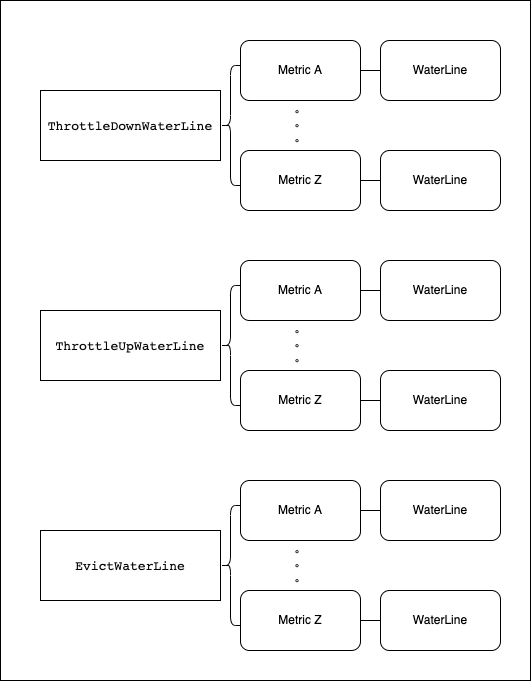
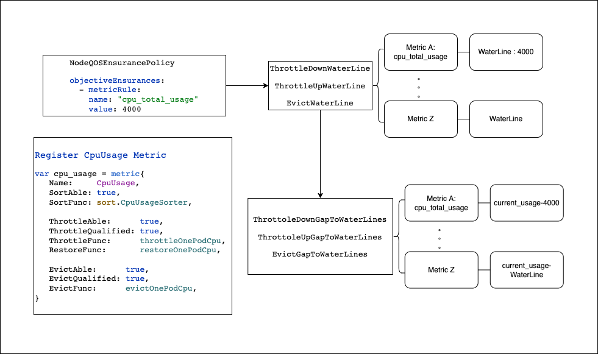

# Pod Sorting And Precise Execution For Crane Agent
该proposal丰富了crane-agent的排序策略，完善了通用排序。并且实现了一套精准操作(压制/驱逐)的框架，在执行压制/驱逐等操作时，操作到用户指定的水位线即停止的精确操作逻辑，避免了对于低优pod的过度操作；

具体来说：

- 丰富了crane-agent的排序策略，完善了通用排序和cpu usage为主要参考的cpu维度排序；

- 针对cpu usage，实现了执行压制/驱逐等操作时，操作到用户指定的水位线即停止的精确操作逻辑，避免了对于低优pod的过度操作；

- 实现了一套精确操作(压制/驱逐)的框架，通过完善自定义指标的一些列属性和实现，即可在无需关心具体细节的情况下，同样具有同cpu usage一样的精确操作能力，具有一定的普适性和扩展性。

## Table of Contents

<!-- TOC -->

- [Pod Sorting And Precise Execution For Crane Agent](#Pod Sorting And Precise Execution For Crane Agent)
    - [Table of Contents](#table-of-contents)
    - [Motivation](#motivation)
        - [Goals](#goals)
    - [Proposal](#proposal)
        - [丰富pod的排序策略](#丰富pod的排序策略)
        - [metric属性的定义](#metric属性的定义)
        - [如何根据水位线进行精准控制](#如何根据水位线进行精准控制)
        - [以水位线为基准进行pod的精确操作](#以水位线为基准进行pod的精确操作)
            - [analyzer阶段](#analyzer阶段)
            - [executor阶段](#executor阶段)
        - [Non-Goals/Future Work](#non-goalsfuture-work)
        - [User Stories](#user-stories)

<!-- /TOC -->
## Motivation
当前在crane-agent中，当超过NodeQOS中指定的水位线后，执行evict，throttle等操作时先对低优先级的pod进行排序，当前排序的依据是pod的ProrityClass，然后在排序的pod进行throttle或者evict操作；

目前存在的问题有：

1. 排序只参考ProrityClass，无法满足基于其他特性的排序；同时也无法满足按照水位线精确操作对灵活排序的需求，无法满足尽快让节点达到指定的水位线的要求。例如我们希望尽快降低低优先级业务的cpu使用量时，应该选出cpu使用量较多的pod，这样能够更快地降低cpu用量，保障高优业务不受影响。

2. 在触发NodeQOS中指定的水位线后，会对于节点上的所有低于指定ProrityClass的pod进行操作；例如，当前节点上有10个pod低于指定ProrityClass，在触发水位线后，会对这10个pod都进行操作，但是实际上可能在操作完成对第一个pod的操作后就可以低于NodeQOS中的指标值了，对剩下的pod的操作，属于过度操作，是可以避免的。如果能以NodeQOS中的指标值作为水位线对pod进行精确的操作，操作到刚好低于水位线是更为合适的，就能避免对低优先级服务的过度影响。

### Goals

- 丰富了crane-agent的排序策略，包括以pod cpu用量为主要参照的排序，以pod内存用量为主要参照的排序，基于运行时间的排序，基于扩展资源使用率的排序。
- 实现一套包含排序和精确操作的框架，支持对不同的指标丰富排序规则，并且实现精确操作。
- 实现针对cpu usage和memmory usage的精确操作，当整机负载超过NodeQOS中指定的水位线后，会先对低优先级的pod进行排序，然后按照顺序操作到刚好低于水位线为止。

## Proposal

### 丰富pod的排序策略

- 该proposal实现了一些通用的排序方法（之后会更多地完善）：
  
  classAndPriority： 比较两个pod的QOSClass和class value，优先比较QOSClass，再比较class value；priority高的排在后面优先级更高

  runningTime：比较两个pod的运行时间，运行时间长的排在后面优先级更高

  如果仅需使用这两个排序策略，使用默认的排序方法即可：会首先比较pod的优先级，之后比较pod对应指标的用量，之后比较pod的运行时长，有一个维度可以比较出结果即为pod的排序结果
    ```go
    func GeneralSorter(pods []podinfo.PodContext) {
        orderedBy(classAndPriority, runningTime).Sort(pods)
    }
    ```

- cpu usage 使用量的排序

    会依次比较两个pod的优先级，如果优先级相同的情况下，再比较cpu用量，如果cpu用量也相同的情况下继续比较ext cpu资源用量（这个是cpu属性较为特殊的一点）, 最后比较pod的运行时长，当某一个指标存在差异时即可返回比较结果

    ```go
    func CpuUsageSorter(pods []podinfo.PodContext) {
        orderedBy(classAndPriority, cpuUsage, extCpuUsage, runningTime).Sort(pods)
    }
    ```

- ext cpu usage 使用量的排序

  会首先比较两个pod是否使用了扩展的cpu资源，在都使用了的情况下，比较 扩展cpu资源使用量/ 扩展cpu资源limit的比值


- 针对需要自定义的指标，可以通过实现如下的方法，并且随意搭配通用的排序方法即可方便地实现pod的灵活自定义排序，以<metric>代表自定义metric指标，<metric-sort-func>代表自定义的针对<metric>的排序策略
    ```go
    func <metric>Sorter(pods []podinfo.PodContext) {
        orderedBy(classAndPriority, <metric-sort-func>, runningTime).Sort(pods)
    }
    ```
    其中<metric-sort-func>只需要实现如下的排序方法即可
    ```go
    func (p1, p2 podinfo.PodContext) int32 
    ```


### metric属性的定义

为了更好的基于NodeQOS配置的metric进行排序和精准控制，对metric引入属性的概念。

metric的属性包含如下几个：

1. Name 表明了metric的名称，需要同collector模块中收集到的指标名称一致
2. ActionPriority 表示指标的优先级，0为最低，10为最高
3. SortAble 表明该指标是否可以排序
4. SortFunc 对应的排序方法，排序方法可以排列组合一些通用方法，再结合指标自身的排序，将在下文详细介绍
5. ThrottleAble 表明针对该指标，是否可以对pod进行压制，例如针对cpu使用量这个metric，就有相对应的压制手段，但是对于memory使用量这种指标，就只能进行pod的驱逐，无法进行有效的压制
6. ThrottleQuantified 表明压制（restore）一个pod后，能否准确计算出经过压制后释放出的对应metric的资源量，我们将可以准确量化的指标称为可Quantified，否则为不可Quantified；
   比如cpu用量，可以通过限制cgroup用量进行压制，同时可以通过当前运行值和压制后的值计算压制后释放的cpu使用量；而比如memory usage就不属于压制可量化metric，因为memory没有对应的throttle实现，也就无法准确衡量压制一个pod后释放出来的memory资源具体用量；
7. ThrottleFunc，执行Throttle动作的具体方法，如果不可Throttle，返回的released为空
8. RestoreFunc，被Throttle后，执行恢复动作的具体方法，如果不可Restore，返回的released为空
9. EvictAble，EvictQuantified，EvictFunc 对evict动作的相关定义，具体内容和Throttle动作类似


```go
type metric struct {
	Name WaterLineMetric

	ActionPriority int

	SortAble bool
	SortFunc func(pods []podinfo.PodContext)

	ThrottleAble      bool
	ThrottleQuantified bool
	ThrottleFunc      func(ctx *ExecuteContext, index int, ThrottleDownPods ThrottlePods, totalReleasedResource *ReleaseResource) (errPodKeys []string, released ReleaseResource)
	RestoreFunc       func(ctx *ExecuteContext, index int, ThrottleUpPods ThrottlePods, totalReleasedResource *ReleaseResource) (errPodKeys []string, released ReleaseResource)

	EvictAble      bool
	EvictQuantified bool
	EvictFunc      func(wg *sync.WaitGroup, ctx *ExecuteContext, index int, totalReleasedResource *ReleaseResource, EvictPods EvictPods) (errPodKeys []string, released ReleaseResource)
}
```

用户可以自行定义自己的metric，在构造完成后，通过registerMetricMap()进行注册即可

### 如何根据水位线进行精准控制

- 根据多个NodeQOS及其中的objectiveEnsurances构建多条水位线:  
  1. 按照objectiveEnsurances对应的action进行分类，目前crane-agent有3个针对节点Qos进行保障的操作，分别是Evict，ThtottleDown（当前用量高于objectiveEnsurances中的值时对pod进行用量压制）和ThrottleUp（当前用量低于objectiveEnsurances中的值时对pod的用量进行放宽恢复），因此会有三个水位线集合，分别是
     ThrottleDownWaterLine，ThrottleUpWaterLine和EvictWaterLine

  2. 再对同一操作种类中的水位线按照其metric rule（图中以metric A，metric Z作为示意）进行分类，并记录每个objectiveEnsurances水位线的值，记为waterLine； 

      ThrottleDownWaterLine，ThrottleUpWaterLine和EvictWaterLine的结构是这样的：
      `type WaterLines map[WaterLineMetric]*WaterLine`
    
      其中WaterLineMetric就是上面的metric的Name字段，value的WaterLine就是资源数值
      `type WaterLine resource.Quantity`  
  
    最终形成一个类似下图的数据存储：  
    

- 构造实时用量到水位线的差值：   
结合当前节点的指标实时用量与WaterLines中该指标对应的水位线中最小值的差值构造如下的数据结构，代表到当前用量到水位线的差值  
   `type GapToWaterLines map[WaterLineMetric]float64`

    其中key值为metric的Name字段，value为用量到水位线的差值； 

    需要注意对于ThrottleUp，需要用水位线最小值-当前用量作为gap值，对于其他两者，使用当前用量-水位线最小值作为gap值，即始终保持gap值为正
    
    下面三个数据分别代表了需要执行evict，ThtottleDown和ThrottleUp操作的指标及其对应的到最低水位线的差值
    ```go
    EvictGapToWaterLines[metrics]     
    ThrottoleDownGapToWaterLines[metrics]
    ThrottleUpGapWaterLine[metrics]
    ```
    
- 以CpuUsage这个metric为例，构造节点cpu用量相关的waterline的流程和相关数据结构如下：  
    

### 以水位线为基准进行pod的精确操作
该proposal为了实现以水位线为基准进行pod的精确操作，将对analyzer部分和executor部分做一定的修改，大体流程是：

在analyzer阶段构造针对不同操作（驱逐，压制等）和不同metric的水位线，将原先的排序逻辑删除，后移到需要进行正式操作的executor阶段，并且可能会需要进行多轮排序；

在executor阶段，根据水位线中的涉及的指标进行其相应的排序，获取最新用量，构造GapToWaterLines，并进行精确操作

#### analyzer阶段
在该阶段进行NodeQOS到WaterLines的转换，并对相同actionName和metricrule的规则进行合并，具体内容上文已经介绍过了

#### executor阶段
压制过程：

1. 首先分析ThrottoleDownGapToWaterLines中涉及的metrics，将这些metrics根据其Quantified属性区分为两部分，如果存在不可Quantified的metric，则通过GetHighestPriorityThrottleAbleMetric获取具有最高ActionPriority的一个throttleAble（具有throttleFunc）的metric对所选择的所有pod进行压制操作，因为但凡存在一个不可Quantified的metric，就无法进行精确的操作

2. 通过getStateFunc()获取当前节点和workload的最新用量，依据ThrottoleDownGapToWaterLines和实时用量构造GapToWaterLine（需要注意的是，在构造GapToWaterLine时，会以注册过的metric进行遍历，所以最终构造出来的GapToWaterLine中的metrics，会是ThrottoleDownGapToWaterLines
   中注册过的metric，避免了在NodeQOS中配置错误不存在或未注册metric的情况）

3. 如果GapToWaterLine中有metric的实时用量无法获取（HasUsageMissedMetric），则通过GetHighestPriorityThrottleAbleMetric获取具有最高ActionPriority的一个throttleAble（具有throttleFunc）的metric对所选择的所有pod进行压制操作，因为如果存在metric实时用量无法获取，就无法获知和水位线的gap，也就无法进行精确的操作

4. 如果不存在3中的情况，则遍历ThrottoleDownGapToWaterLines中可以量化的metric：如果metric具有排序方法则直接使用其SortFunc对pod进行排序，如果没有就使用GeneralSorter进行排序，之后使用其对应的ThrottleFunc对pod进行压制，并计算释放出来的对应metric的资源量，直到ThrottoleDownGapToWaterLines中该metric对应的gap已不存在
```go
//将所有触发水位线的metrics根据其Quantified属性区分为两部分
metricsQuantified, MetricsNotQuantified := ThrottleDownWaterLine.DivideMetricsByQuantified()
// 如果存在不可Quantified的metric，获取具有最高ActionPriority的一个throttleAble的metric对所选择的所有pod进行操作
if len(MetricsNotThrottleQuantified) != 0 {
    highestPrioriyMetric := GetHighestPriorityThrottleAbleMetric()
    if highestPrioriyMetric != "" {
        t.throttlePods(ctx, &totalReleased, highestPrioriyMetric)
    }
} else {
    //获取节点和workload的最新用量，构造和水位线差距
    ThrottoleDownGapToWaterLines = buildGapToWaterLine(ctx.getStateFunc())
    //如果触发水位线中存在metric的实时用量无法获取，则获取具有最高ActionPriority的一个throttleAble的metric对所选择的所有pod进行压制操作
    if ThrottoleDownGapToWaterLines.HasUsageMissedMetric() {
        highestPrioriyMetric := ThrottleDownWaterLine.GetHighestPriorityThrottleAbleMetric()
        if highestPrioriyMetric != "" {
            throttlePods(ctx, &totalReleased, highestPrioriyMetric)
        }
    } else {
        var released ReleaseResource
		//遍历触发水位线的metric中可以量化的metric：如果metric具有排序方法则直接使用其SortFunc对pod进行排序，否则使用GeneralSorter排序；
		//之后使用其对应的操作方法对pod执行操作，并计算释放出来的对应metric的资源量，直到对应metric到水位线的差距已不存在
        for _, m := range metricsQuantified {
            if m.SortAble {
                m.SortFunc(ThrottleDownPods)
            } else {
                GeneralSorter(ThrottleDownPods)
            }
    
            for !ThrottoleDownGapToWaterLines.TargetGapsRemoved(m) {
                for index, _ := range ThrottleDownPods {
                    released = m.ThrottleFunc(ctx, index, ThrottleDownPods, &totalReleased)
                    ThrottoleDownGapToWaterLines[m] -= released[m]
                }
            }
        }
    }
}
```

驱逐过程：

驱逐和压制的流程是一样的，除了在对pod进行操作的时候需要额外判断一下pod是否已经被驱逐了；取出一个没有执行过的pod，执行驱逐操作，并计算释放出的各metric资源量，同时在对应水位线中减去释放的值，直到满足当前metric水位线要求
```go
metricsEvictQuantified, MetricsNotEvcitQuantified := EvictWaterLine.DivideMetricsByEvictQuantified()

if len(MetricsNotEvcitQuantified) != 0 {
    highestPrioriyMetric := e.EvictWaterLine.GetHighestPriorityEvictAbleMetric()
    if highestPrioriyMetric != "" {
		e.evictPods(ctx, &totalReleased, highestPrioriyMetric)
    }
} else {
    EvictGapToWaterLines = buildGapToWaterLine(ctx.getStateFunc(), ThrottleExecutor{}, *e)
	if EvictGapToWaterLines.HasUsageMissedMetric() {
        highestPrioriyMetric := EvictWaterLine.GetHighestPriorityEvictAbleMetric()
        if highestPrioriyMetric != "" {
            e.evictPods(ctx, &totalReleased, highestPrioriyMetric)
        }
    } else {
		wg := sync.WaitGroup{}
        var released ReleaseResource
        for _, m := range metricsEvictQuantified {
            if MetricMap[m].SortAble {
                MetricMap[m].SortFunc(e.EvictPods)
            } else {
                execsort.GeneralSorter(e.EvictPods)
            }
    
            for !EvictGapToWaterLines.TargetGapsRemoved(m) {
                if podinfo.HasNoExecutedPod(e.EvictPods) {
                    index := podinfo.GetFirstNoExecutedPod(e.EvictPods)
                    released = MetricMap[m].EvictFunc(&wg, ctx, index, &totalReleased, e.EvictPods)
    
                    e.EvictPods[index].HasBeenActioned = true
                    ctx.EvictGapToWaterLines[m] -= released[m]
                }
            }
        }
        wg.Wait()
        }
}
```

### Non-Goals/Future Work

- 当前只支持cpu usage的精确操作，但是框架可以复用，后续可以基于精准控制的框架，实现更多维度指标的精准控制。
- 在做精准控制时，目前只考虑metric本身释放量，未考虑不同metric之间的相互影响。比如压制cpu usage时，memory usage也会受到影响。如果指标非常多，不同指标之间的关系会非常复杂，所以暂时不考虑不同metric直接的相互影响。

### User Stories

- 用户可以使用crane-agent进行更好的QoS保障。支持更快速的降低节点负载，以保障高优先级业务不受影响。同时对低优先级业务的压制/驱逐动作，进行精确控制，避免过度操作。
- 用户可以借助实现的精准操作(压制/驱逐)的框架，在无需关心细节的情况下，通过实现自定义metric相关的属性和方法，即可方便地实现以自定义metric为核心的具有精确操作和排序能力的QoS功能。
