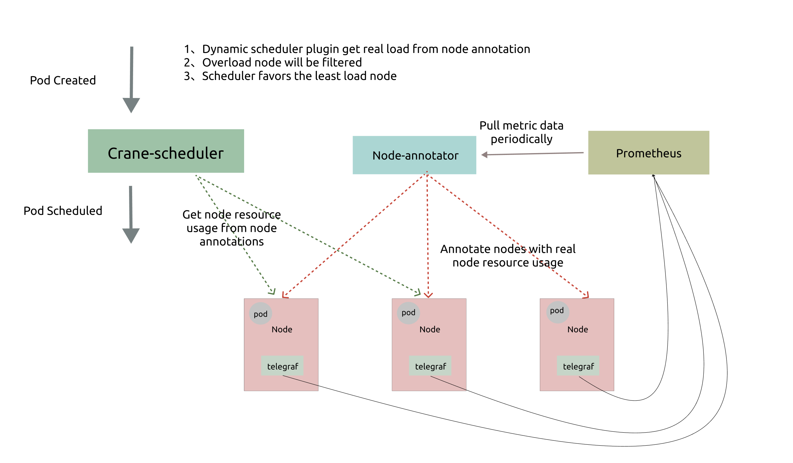

# Dynamic Scheduler：負載感知調度器插件

## 介紹
kubernetes 的原生調度器只能通過資源請求來調度 pod，這很容易造成一系列負載不均的問題：

- 對於某些節點，實際負載與資源請求相差不大，這會導致很大概率出現穩定性問題。
- 對於其他節點來說，實際負載遠小於資源請求，這將導致資源的巨大浪費。

為了解決這些問題，動態調度器根據實際的節點利用率構建了一個簡單但高效的模型，並過濾掉那些負載高的節點來平衡集群。

## 設計細節

### 架構 

如上圖，動態調度器依賴於`Prometheus`和`Node-exporter`收集和匯總指標數據，它由兩個組件組成：

!!! note "Note"
    `Node-annotator` 目前是 `Crane-scheduler-controller`的一個模塊.

- `Node-annotator`定期從 Prometheus 拉取數據，並以註釋的形式在節點上用時間戳標記它們。
- `Dynamic plugin`直接從節點的註釋中讀取負載數據，過濾並基於簡單的算法對候選節點進行評分。

###  調度策略
動態調度器提供了一個默認值[調度策略](../deploy/manifests/policy.yaml)並支持用戶自定義策略。默認策略依賴於以下指標：

- `cpu_usage_avg_5m`
- `cpu_usage_max_avg_1h`
- `cpu_usage_max_avg_1d`
- `mem_usage_avg_5m`
- `mem_usage_max_avg_1h`
- `mem_usage_max_avg_1d`
  
在調度的`Filter`階段，如果該節點的實際使用率大於上述任一指標的閾值，則該節點將被過濾。而在`Score`階段，最終得分是這些指標值的加權和。

### Hot Value

在生產集群中，可能會頻繁出現調度熱點，因為創建 Pod 後節點的負載不能立即增加。因此，我們定義了一個額外的指標，名為`Hot Value`，表示節點最近幾次的調度頻率。並且節點的最終優先級是最終得分減去`Hot Value`。