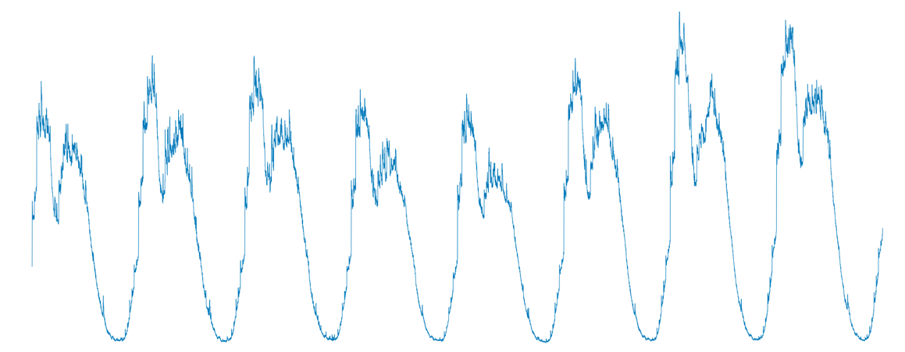
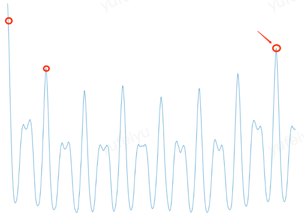
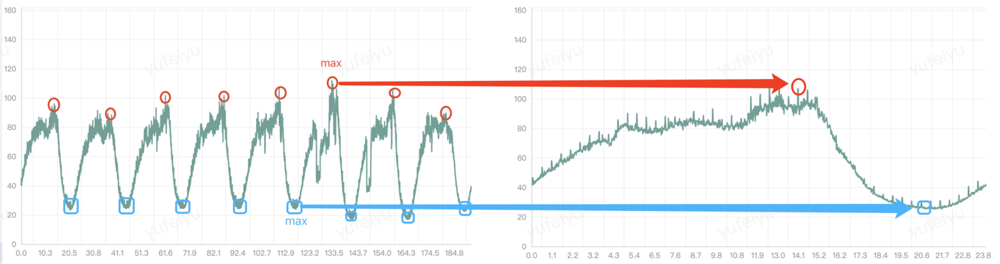
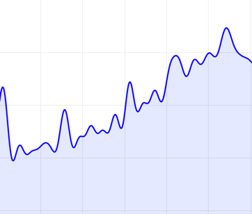
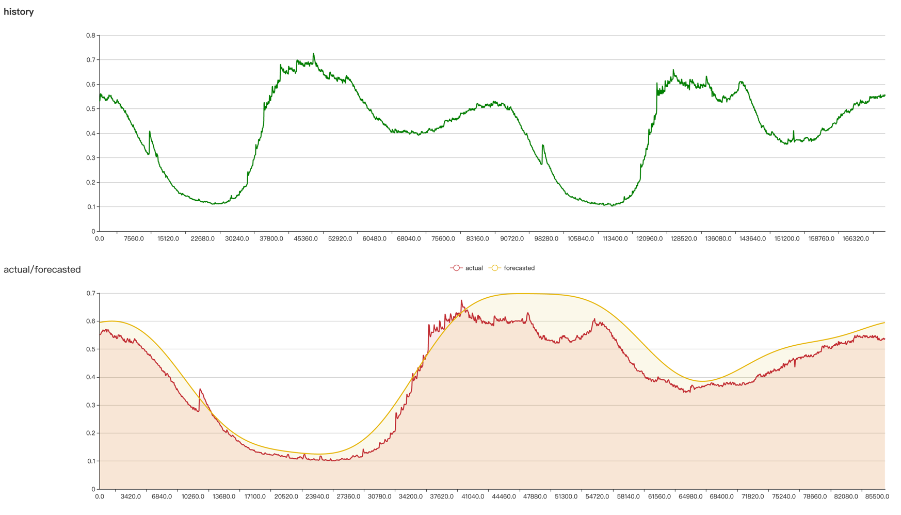

# DSP Prediction Algorithm
Crane uses the discrete Fourier transform and autocorrelation function commonly used in the field of Digital Signal Processing (DSP) to identify and predict periodic time series.

This article will introduce the implementation process and parameter settings of the DSP algorithm in order to help you understand the principles behind the algorithm and apply it to practical scenarios. (The related code is located in the pkg/prediction/dsp directory)

## Process

### Pre-processing

#### Fill in missing data
It is common for monitoring data to be missing at certain points in time. Crane will fill in the missing sampling points based on the before and after data. The approach is as follows.

Assume that the data sampled between the $m$th and $n$th sample points are missing ($m+1 < n$), and the sample values at the $m$ and $n$ points are $v_m$ and $v_n$ respectively, so that $$\Delta = {v_n-v_m \over n-m}$$, then the filled data between $m$ and $n$ are $$v_m+\Delta , v_m+2\ Delta , ... $


#### Removing outliers
Occasionally, there are extreme outlier data points in the monitoring data. There are many reasons for these outliers, such as:

1. Monitoring systems filling missing sample points with zero values.
2. The monitored component reports incorrect metric data due to its own bugs.
3. Application startup consumes far more resources than normal runtime

These extreme anomalies can be disruptive to the signal cycle determination and need to be removed. The approach is as follows:

Select $P99.9$ and $P0.1$ of all sampling points in the actual sequence as the upper and lower thresholds, respectively, and if a sample value is below the lower limit or above the upper limit, set the value of the sampling point to the previous sample value.


#### Discrete Fourier Transform
A fast discrete Fourier transform (FFT) is performed on the monitored time series (set length $N$) to obtain a spectrogram of the signal, which is visualized as "shocks" at each discrete point $k$. The height of the shock is the "amplitude" of the corresponding periodic component of $k$, and the value of $k$ ranges from $(0,1,2, ... N-1)$.

The "DC component" of the corresponding signal has no effect on the period and is therefore ignored.

Since the first half and the second half of the discrete Fourier transformed spectral sequence are conjugate symmetric, which is reflected on the spectrogram as being symmetric about the axis, it is sufficient to look at only the first half $$N/2$$.

The corresponding period $$T = {N \over k} \bullet SampleInterval$$

To see if a signal has a period of $$T$$, one needs to observe at least twice the length of $$T$$, so the longest period that can be identified by a sequence of length $$N$$ is $$N/2$$. So $k = 1$ can be ignored.

Up to this point, $k$ takes values in the range $(2, 3, ... , N/2)$, corresponding to the periods $N/2, N/3, ... $, which is the "resolution" of the period information that the FFT can provide. If the period of a signal does not fall on $N/k$, it will scatter to the whole frequency domain, leading to "frequency leakage". The good thing is that in a real production environment, the applications we usually encounter (especially online businesses), if there is a regularity, are on a 'day' cycle, and some businesses may have the so-called 'weekend' effect, i.e., weekends are not quite the same as weekdays, and they are equally well periodic if expanded to the 'week' granularity of observation.

Instead of trying to discover cycles of arbitrary length, Crane specifies several fixed cycle lengths ($1d, $7d$) to determine. And by intercepting and padding, the length of the sequence $N$ is guaranteed to be an integer multiple of the cycle $T$ to be detected, e.g., $T=1d, N=3d; T=7d, N=14d$.

We grabbed some application monitoring metrics from the production environment, saved them in csv format, and put them in the pkg/prediction/dsp/test_data directory. For example, the input0.csv file includes the CPU monitoring data of an application for 8 consecutive days, corresponding to the time series as follows.



We see that although the data varies from day to day, the general 'pattern' is still basically the same.

Doing an FFT on it yields the following spectrogram.


We find that the 'amplitude' at a few points is significantly higher than others, and these points can be used as our 'candidate cycles' for further verification.

The above is our intuitive judgment, how does Crane select the "candidate cycles"?

1. The original sequence $\vec x(n)$ is randomized to get the sequence $\vec x'(n)$, then we do FFT on $\vec x'(n)$ to get $\vec X'(k)$, so that $P_{max} = argmax|\vec X'(k)|$.

2. Repeat the above operation 100 times to get 100 $P_{max}$, and take $P99$ as the threshold $P_{threshold}$.

3. Do FFT on the original sequence $\vec x(n)$ to get $\vec X(f)$, traverse $k = 2, 3, ... $, if $P_k = |X(k)| > P_{threshold}$, then $k$ is added to the candidate cycle.

#### Cyclic autocorrelation function
The Auto Correlation Function (ACF) is the correlation of a signal with itself at different points in time. In layman's terms, it is the similarity between two observations as a function of the time difference between them.

Crane uses the Circular ACF to first extend a time series of length $N$ with a period of $N$, i.e., in $... , [-N, -1], [N, 2N-1], ... $ interval copy $\vec x(n)$ to get a new sequence $\vec x'(n)$. Then compute the sequential translation of $\vec x'(n)$ by $k=1,2,3,... .N/2$ after $\vec x'(n+k)$ and $\vec x'(n)$.

$$r_k={\displaystyle\sum_{i=-k}^{N-k-1} (x_i-\mu)(x_{i+k}-\mu) \over \displaystyle\sum_{i=0}^{N-1} (x_i-\mu)^2}\ \ \ \mu: mean$$

Instead of using the above definition directly to calculate the ACF, Crane passes the $(I)FFT$ twice according to the following formula, thus being able to complete the ACF in $O(nlogn)$ time.
$$\vec r = IFFT(|FFT({\vec x - \mu \over \sigma})|^2)\ \ \ \mu: mean,\ \sigma: standard\ deviation$$

The image of ACF is shown below, the horizontal axis represents the time length $k$ of the signal translation; the vertical axis represents the autocorrelation coefficient $r_k$, which reflects the degree of "similarity" between the translation signal and the original signal.



Crane will verify whether the autocorrelation coefficient of each candidate period is on the "peak" in turn; and select the candidate period corresponding to the "highest peak" as the main period (fundamental period) of the whole time series, and use it as the basis for prediction.

How to determine the "peak"?

Crane selects a section of the curve on each side and does a linear regression. When the slopes of the left and right lines are greater than or less than zero after the regression, the point is considered to be on a "mountain top".


#### Prediction
Based on the main cycle obtained in the previous step, Crane provides two ways to fit (predict) the time series data of the next cycle **maxValue**

The maximum value at the same moment $t$ (e.g., 6:00 PM) in the last few cycles is chosen as the predicted value at the moment $t$ of the next cycle.


 **fft**

Do FFT on the original time series to get the spectral series, remove the "high frequency noise", then do IFFT (Inverse Fast Fourier Transform), and use the obtained time series as the prediction result for the next cycle.

## Applications
Crane provides `TimeSeriesPrediction`, through this CRD, users can make predictions for various time series, such as CPU utilization of work responsible, QPS of application, etc.
```yaml
apiVersion: prediction.crane.io/v1alpha1
kind: TimeSeriesPrediction
metadata:
  name: tsp-workload-dsp
  namespace: default
spec:
  targetRef:
    apiVersion: apps/v1
    kind: Deployment
    name: test
    namespace: default
  predictionWindowSeconds: 7200 # Provide prediction data for the next 7200 seconds (2 hours). crane will write the prediction data to status.
  predictionMetrics:
    - resourceIdentifier: workload-cpu
      type: ExpressionQuery
      expressionQuery:
        expression: 'sum (irate (container_cpu_usage_seconds_total{container!="",image!="",container!="POD",pod=~"^test-. *$"}[1m]))' # Query statement to get historical monitoring data
      algorithm:
        algorithmType: "dsp" # Specify dsp as the prediction algorithm
        dsp:
          sampleInterval: "60s" # The sampling interval for monitoring data is 1 minute
          historyLength: "15d" # Pull the last 15 days of monitoring metrics as the basis for prediction
          estimators: # Specify the prediction method, including 'maxValue' and 'fft', each category can specify multiple estimators with different parameters, and crane will select the one with the best fit to generate the prediction results. If not specified, 'fft' will be used by default.
# maxValue:
# - marginFraction: "0.1"
            fft:
              - marginFraction: "0.2"
                lowAmplitudeThreshold: "1.0"
                highFrequencyThreshold: "0.05"
                minNumOfSpectrumItems: 10
                maxNumOfSpectrumItems: 20
```
The meanings of some of the dsp parameters in the above example are as follows.

**maxValue**

`marginFraction`: After fitting the series for the next period, multiply each predicted value by `1 + marginFraction`, e.g. `marginFraction = 0.1`, which is multiplied by 1.1. `marginFraction` is used to scale up (or down) the predicted data by a certain percentage.

**fft**

`marginFraction`: After fitting the next period of the series, multiply each predicted value by `1 + marginFraction`, e.g. `marginFraction = 0.1`, which is multiplied by 1.1. `marginFraction` serves to scale the predicted data up (or down) by a certain percentage.

`lowAmplitudeThreshold`: The lower limit of the amplitude of the spectrum, all frequency components with amplitudes below this lower limit will be filtered out.

`highFrequencyThreshold`: The upper frequency limit, all frequencies above this limit will be filtered out. Unit Hz, for example, if you want to ignore the length of the period component less than 1 hour, set `highFrequencyThreshold = 1/3600`.

`minNumOfSpectrumItems`: the minimum number of frequency components to keep.

`maxNumOfSpectrumItems`: the maximum number of frequency components to keep.

In simple terms, the lower the number of reserved frequency components, the lower the upper frequency limit, and the higher the lower limit of spectral amplitude, the smoother the predicted curve will be, but some details will be lost; conversely, the more burrs the curve will have, the more details will be preserved.

Below are two curves predicted for the same time period, the blue and green `highFrequencyThreshold` is $0.01$ and $0.001$ respectively, the blue curve filters out more high frequency components, so it is smoother.

 

There is no one set of parameter configurations for all time series, and it is usually necessary to adjust the algorithm parameters according to the characteristics of the applied metrics in order to obtain the best prediction results. Crane provides a web interface that allows users to visualize the prediction effect after adjusting the parameters, using the following steps.

1. Modify the parameters of the `estimators` in `TimeSeriesPrediction`.
2. Visit `api/prediction/debug/<namespace>/<timeseries prediction name>` of craned http server to see the effect of the parameters (see below).



The above steps can be performed multiple times until you get satisfactory prediction results.

**Local debugging via port-forward**

The port of craned http server is set by craned startup parameter `--server-bind-port`, the default is `8082`.

Open a terminal with
```sh
$kubectl -n crane-system port-forward service/craned 8082:8082
Forwarding from 127.0.0.1:8082 -> 8082
Forwarding from [::1]:8082 -> 8082
```

Open the brower, access `http://localhost:8082/api/prediction/debug/<namespace>/<timeseries prediction name>`