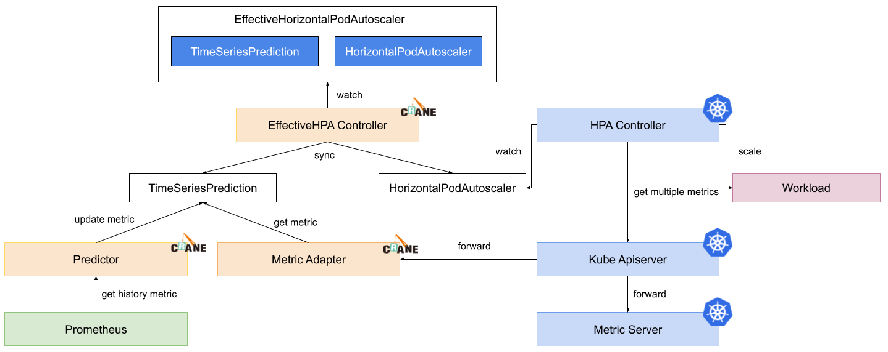

# EffectiveHorizontalPodAutoscaler

EffectiveHorizontalPodAutoscaler helps you manage application scaling in an easy way. 

It is compatible with HorizontalPodAutoscaler but extends more features.

EffectiveHorizontalPodAutoscaler supports prediction-driven autoscaling. 

With this capability, user can forecast the incoming peak flow and scale up their application ahead, also user can know when the peak flow will end and scale down their application gracefully.

Besides that, EffectiveHorizontalPodAutoscaler also defines several scale strategies to support different scaling scenarios.

## Features
A EffectiveHorizontalPodAutoscaler sample yaml looks like below:

```yaml
apiVersion: autoscaling.crane.io/v1alpha1
kind: EffectiveHorizontalPodAutoscaler
metadata:
  name: php-apache
spec:
  scaleTargetRef: #(1)
    apiVersion: apps/v1
    kind: Deployment
    name: php-apache
  minReplicas: 1 #(2)
  maxReplicas: 10 #(3)
  scaleStrategy: Auto #(4)
  metrics: #(5)
  - type: Resource
    resource:
      name: cpu
      target:
        type: Utilization
        averageUtilization: 50
  prediction: #(6)
    predictionWindowSeconds: 3600 #(7)
    predictionAlgorithm:
      algorithmType: dsp
      dsp:
        sampleInterval: "60s"
        historyLength: "3d"
```

1. ScaleTargetRef is the reference to the workload that should be scaled.
2. MinReplicas is the lower limit replicas to the scale target which the autoscaler can scale down to.
3. MaxReplicas is the upper limit replicas to the scale target which the autoscaler can scale up to.
4. ScaleStrategy indicates the strategy to scaling target, value can be "Auto" and "Preview".
5. Metrics contains the specifications for which to use to calculate the desired replica count.
6. Prediction defines configurations for predict resources.If unspecified, defaults don't enable prediction.
7. PredictionWindowSeconds is the time window to predict metrics in the future.

### Prediction-driven autoscaling
Most of online applications follow regular pattern. We can predict future trend of hours or days. DSP is a time series prediction algorithm that applicable for application metrics prediction.

The following shows a sample EffectiveHorizontalPodAutoscaler yaml with prediction enabled.
```yaml
apiVersion: autoscaling.crane.io/v1alpha1
kind: EffectiveHorizontalPodAutoscaler
spec:
  prediction:
    predictionWindowSeconds: 3600
    predictionAlgorithm:
      algorithmType: dsp
      dsp:
        sampleInterval: "60s"
        historyLength: "3d"

```

#### Metric conversion

When user defines `spec.metrics` in EffectiveHorizontalPodAutoscaler and prediction configuration is enabled, EffectiveHPAController will convert it to a new metric and configure the background HorizontalPodAutoscaler. 

This is a source EffectiveHorizontalPodAutoscaler yaml for metric definition.
```yaml
apiVersion: autoscaling.crane.io/v1alpha1
kind: EffectiveHorizontalPodAutoscaler
spec:
  metrics:
  - type: Resource
    resource:
      name: cpu
      target:
        type: Utilization
        averageUtilization: 50
```

It's converted to underlying HorizontalPodAutoscaler metrics yaml.
```yaml
apiVersion: autoscaling/v2beta1
kind: HorizontalPodAutoscaler
spec:
  metrics:
    - pods:
        metric:
          name: crane_pod_cpu_usage
          selector:
            matchLabels:
              autoscaling.crane.io/effective-hpa-uid: f9b92249-eab9-4671-afe0-17925e5987b8
        target:
          type: AverageValue
          averageValue: 100m
      type: Pods
    - resource:
        name: cpu
        target:
          type: Utilization
          averageUtilization: 50
      type: Resource
```

In this sample, the resource metric defined by user is converted into two metrics: prediction metric and origin metric.

* **prediction metric** is custom metrics that provided by component MetricAdapter. Since custom metric doesn't support `targetAverageUtilization`, it's converted to `targetAverageValue` based on target pod cpu request.
* **origin metric** is equivalent to user defined metrics in EffectiveHorizontalPodAutoscaler, to fall back to baseline user defined in case of some unexpected situation e.g. business traffic sudden growth.

HorizontalPodAutoscaler will calculate on each metric, and propose new replicas based on that. The **largest** one will be picked as the new scale.

#### Horizontal scaling process
There are six steps of prediction and scaling process:

1. EffectiveHPAController create HorizontalPodAutoscaler and TimeSeriesPrediction instance 
2. PredictionCore get historic metric from prometheus and persist into TimeSeriesPrediction
3. HPAController read metrics from KubeApiServer
4. KubeApiServer forward requests to MetricAdapter and MetricServer
5. HPAController calculate all metric results and propose a new scale replicas for target
6. HPAController scale target with Scale Api

Below is the process flow.


#### Use case
Let's take one use case that using EffectiveHorizontalPodAutoscaler in production cluster.

We did a profiling on the load history of one application in production and replayed it in staging environment. With the same application, we leverage both EffectiveHorizontalPodAutoscaler and HorizontalPodAutoscaler to manage the scale and compare the result.

From the red line in below chart, we can see its actual total cpu usage is high at ~8am, ~12pm, ~8pm and low in midnight. The green line shows the prediction cpu usage trend.


Below is the comparison result between EffectiveHorizontalPodAutoscaler and HorizontalPodAutoscaler. The red line is the replica number generated by HorizontalPodAutoscaler and the green line is the result from EffectiveHorizontalPodAutoscaler.


We can see significant improvement with EffectiveHorizontalPodAutoscaler:

* Scale up in advance before peek flow
* Scale down gracefully after peek flow
* Fewer replicas changes than HorizontalPodAutoscaler

### ScaleStrategy
EffectiveHorizontalPodAutoscaler provides two strategies for scaling: `Auto` and `Preview`. User can change the strategy at runtime, and it will take effect on the fly.

#### Auto
Auto strategy achieves automatic scaling based on metrics. It is the default strategy. With this strategy, EffectiveHorizontalPodAutoscaler will create and control a HorizontalPodAutoscaler instance in backend. We don't recommend explicit configuration on the underlying HorizontalPodAutoscaler because it will be overridden by EffectiveHPAController. If user delete EffectiveHorizontalPodAutoscaler, HorizontalPodAutoscaler will be cleaned up too.

#### Preview
Preview strategy means EffectiveHorizontalPodAutoscaler won't change target's replicas automatically, so you can preview the calculated replicas and control target's replicas by themselves. User can switch from default strategy to this one by applying `spec.scaleStrategy` to `Preview`. It will take effect immediately, During the switch, EffectiveHPAController will disable HorizontalPodAutoscaler if exists and scale the target to the value `spec.specificReplicas`, if user not set `spec.specificReplicas`, when ScaleStrategy is change to Preview, it will just stop scaling.

A sample preview configuration looks like following:
```yaml
apiVersion: autoscaling.crane.io/v1alpha1
kind: EffectiveHorizontalPodAutoscaler
spec:
  scaleStrategy: Preview   # ScaleStrategy indicate the strategy to scaling target, value can be "Auto" and "Preview".
  specificReplicas: 5      # SpecificReplicas specify the target replicas.
status:
  expectReplicas: 4        # expectReplicas is the calculated replicas that based on prediction metrics or spec.specificReplicas.
  currentReplicas: 4       # currentReplicas is actual replicas from target
```

### HorizontalPodAutoscaler compatible
EffectiveHorizontalPodAutoscaler is designed to be compatible with k8s native HorizontalPodAutoscaler, because we don't reinvent the autoscaling part but take advantage of the extension from HorizontalPodAutoscaler and build a high level autoscaling CRD. EffectiveHorizontalPodAutoscaler support all abilities from HorizontalPodAutoscaler like metricSpec and behavior.

EffectiveHorizontalPodAutoscaler will continue support incoming new feature from HorizontalPodAutoscaler.

### EffectiveHorizontalPodAutoscaler status
This is a yaml from EffectiveHorizontalPodAutoscaler.Status
```yaml
apiVersion: autoscaling.crane.io/v1alpha1
kind: EffectiveHorizontalPodAutoscaler
status:
  conditions:                                               
  - lastTransitionTime: "2021-11-30T08:18:59Z"
    message: the HPA controller was able to get the target's current scale
    reason: SucceededGetScale
    status: "True"
    type: AbleToScale
  - lastTransitionTime: "2021-11-30T08:18:59Z"
    message: Effective HPA is ready
    reason: EffectiveHorizontalPodAutoscalerReady
    status: "True"
    type: Ready
  currentReplicas: 1
  expectReplicas: 0

```

### Cron-based autoscaling
EffectiveHorizontalPodAutoscaler supports cron based autoscaling. 

Besides based on monitoring metrics, sometimes there are differences between holiday and weekdays in workload traffic, and a simple prediction algorithm may not work relatively well. Then you can make up for the lack of prediction by setting the weekend cron to have a larger number of replicas.

For some non-web traffic applications, for example, some applications do not need to work on weekends, and then want to reduce the workload replicas to 1, you can also configure cron to reduce the cost for your service.

Following are cron main fields in the ehpa spec:

 - CronSpec: You can set multiple cron autoscaling configurations, cron cycle can set the start time and end time of the cycle, and the number of replicas of the workload can be continuously guaranteed to the set target value within the time range.
 - Name: cron identifier
 - TargetReplicas: the target number of replicas of the workload in this cron time range.
 - Start: The start time of the cron, in the standard linux crontab format
 - End: the end time of the cron, in the standard linux crontab format


Current cron autoscaling capabilities from some manufacturers and communities have some shortcomings.

1. The cron capability is provided separately, has no global view of autoscaling, poor compatibility with HPA, and  conflicts with other scale trigger.
2. The semantics and behavior of cron do not match very well, and are even very difficult to understand when used, which can easily mislead users and lead to autoscaling failures.

The following figure shows the comparison between the current EHPA cron autoscaling implementation and other cron capabilities.


To address the above issues, the cron autoscaling implemented by EHPA is designed on the basis of compatibility with HPA, and cron, as an indicator of HPA, acts on the workload object together with other indicators. In addition, the setting of cron is also very simple. When cron is configured separately, the default scaling of the workload will not be performed when it is not in the active time range.


#### Cron working without other metrics
You can just configure cron itself to work, assume you have no other metrics configured.
```yaml
apiVersion: autoscaling.crane.io/v1alpha1
kind: EffectiveHorizontalPodAutoscaler
metadata:
  name: php-apache-local
spec:
  # ScaleTargetRef is the reference to the workload that should be scaled.
  scaleTargetRef:
    apiVersion: apps/v1
    kind: Deployment
    name: php-apache
  minReplicas: 1        # MinReplicas is the lower limit replicas to the scale target which the autoscaler can scale down to.
  maxReplicas: 100       # MaxReplicas is the upper limit replicas to the scale target which the autoscaler can scale up to.
  scaleStrategy: Auto   # ScaleStrategy indicate the strategy to scaling target, value can be "Auto" and "Manual".
  # Better to setting cron to fill the one complete time period such as one day, one week
  # Below is one day cron scheduling, it
  #80                  --------     ---------        ----------
  #                    |       |    |        |       |         |
  #10       ------------       -----         --------          ----------
  #(time)   0 1 2 3 4 5 6 7 8 9 10 11 12 13 14 15 16 17 18 19 20 21 22 23
  # Local timezone means you use the server's(or maybe is a container's) timezone which the craned running in. for example, if your craned started as utc timezone, then it is utc. if it started as Asia/Shanghai, then it is Asia/Shanghai.
  crons:
    - name: "cron1"
      timezone: "Local"
      description: "scale down"
      start: "0 0 ? * *"
      end: "0 6 ? * *"
      targetReplicas: 10
    - name: "cron2"
      timezone: "Local"
      description: "scale up"
      start: "0 6 ? * *"
      end: "0 9 ? * *"
      targetReplicas: 80
    - name: "cron3"
      timezone: "Local"
      description: "scale down"
      start: "00 9 ? * *"
      end: "00 11 ? * *"
      targetReplicas: 10
    - name: "cron4"
      timezone: "Local"
      description: "scale up"
      start: "00 11 ? * *"
      end: "00 14 ? * *"
      targetReplicas: 80
    - name: "cron5"
      timezone: "Local"
      description: "scale down"
      start: "00 14 ? * *"
      end: "00 17 ? * *"
      targetReplicas: 10
    - name: "cron6"
      timezone: "Local"
      description: "scale up"
      start: "00 17 ? * *"
      end: "00 20 ? * *"
      targetReplicas: 80
    - name: "cron7"
      timezone: "Local"
      description: "scale down"
      start: "00 20 ? * *"
      end: "00 00 ? * *"
      targetReplicas: 10
``` 

CronSpec has following fields.
* **name** defines the name of the cron, cron name must be unique in the same ehpa
* **description** defines the details description of the cron. it can be empty.
* **timezone** defines the timezone of the cron which the crane to schedule in. If unspecified, default use `UTC` timezone. you can set it to `Local` which means you use timezone of the container of crane service running in. Also, `America/Los_Angeles` is ok.
* **start** defines the cron start time schedule, which is crontab format. see https://en.wikipedia.org/wiki/Cron
* **end** defines the cron end time schedule, which is crontab format. see https://en.wikipedia.org/wiki/Cron
* **targetReplicas** defines the target replicas the workload to scale when the cron is active, which means current time is between start and end.

Above means each day, the workload needs to keep the replicas hourly.
```
  #80                  --------     ---------        ----------
  #                    |       |    |        |       |         |
  #1        ------------       -----         --------          ----------
  #(time)   0 1 2 3 4 5 6 7 8 9 10 11 12 13 14 15 16 17 18 19 20 21 22 23
```

Remember **not to set start time is after end**. For example, when you set following:
```
  crons:
    - name: "cron2"
      timezone: "Local"
      description: "scale up"
      start: "0 6 ? * *"
      end: "0 9 ? * *"
      targetReplicas: 80
```
Above is not valid because the start will be always later than end. The hpa controller will always get the workload's desired replica to scale, which means keep the original replicas.


#### Horizontal scaling process
There are six steps of cron-driven and scaling process:
1. EffectiveHPAController creates HorizontalPodAutoscaler which is injected to external cron metrics in spec.
2. HPAController reads cron external metrics from KubeApiServer
3. KubeApiServer forwards requests to MetricAdapter and MetricServer
4. The MetricAdapter finds the cron scaler for target hpa, and detect if the cron scaler is active, which means the current time is between the cron start and end schedule time. It will return the `TargetReplicas` specified in the `CronSpec`.
5. HPAController calculates all metric results and propose a new scale replicas for target by selecting the largest one.
6. HPAController scales target with Scale Api


When use ehpa, users can configure only cron metric, let the ehpa to be used as cron hpa.

Multiple crons of one ehpa will be transformed to one external metric. HPA will fetch this external cron metric and calculates target replicas when reconcile. HPA will select the largest proposal replicas to scale the workload from multiple metrics.


#### Cron working with other metrics together

EffectiveHorizontalPodAutoscaler is compatible with HorizontalPodAutoscaler(Which is kubernetes built in). So if you configured metrics for HPA such as cpu or memory, then the HPA will scale by the real time metric it observed. 

With EHPA, users can configure CronMetric、PredictionMetric、OriginalMetric at the same time.

**We highly recomend you configure metrics of all dimensions. They are represtenting the cron replicas, prior predicted replicas, posterior observed replicas.**

This is a powerful feature. Because HPA always pick the largest replicas calculated by all dimensional metrics to scale. Which will gurantee your workload's QoS, when you configure three types of autoscaling at the same time, the replicas caculated by real metric observed is largest, then it will use the max one. Although the replicas caculated by prediction metric is smaller for some unexpected reason. So you don't be worried about the QoS.


#### Mechanism
When metrics adapter deal with the external cron metric requests, metrics adapter will do following steps.


1. No active cron now, there are two cases:
   
   - no other hpa metrics work with cron together, then return current workload replicas to keep the original desired replicas
   - other hpa metrics work with cron together, then return min value to remove the cron impact for other metrics. when cron is working with other metrics together, it should not return workload's original desired replicas, because there maybe other metrics want to trigger the workload to scale in. hpa controller select max replicas computed by all metrics(this is hpa default policy in hard code), cron will impact the hpa. so we should remove the cron effect when cron is not active, it should return min value.
		
		
2. Has active ones.  we use the largest targetReplicas specified in cron spec. Basically, there should not be more then one active cron at the same time period, it is not a best practice.

HPA will get the cron external metric value, then it will compute the replicas by itself.

#### Use Case

When you need to keep the workload replicas to minimum at midnight, you configured cron. And you need the HPA to get the real metric observed by metrics server to do scale based on real time observed metric. At last you configure a prediction-driven metric to do scale up early and scale down lately by predicting way.

```yaml
apiVersion: autoscaling.crane.io/v1alpha1
kind: EffectiveHorizontalPodAutoscaler
metadata:
  name: php-apache-multi-dimensions
spec:
  # ScaleTargetRef is the reference to the workload that should be scaled.
  scaleTargetRef:
    apiVersion: apps/v1
    kind: Deployment
    name: php-apache
  minReplicas: 1        # MinReplicas is the lower limit replicas to the scale target which the autoscaler can scale down to.
  maxReplicas: 100       # MaxReplicas is the upper limit replicas to the scale target which the autoscaler can scale up to.
  scaleStrategy: Auto   # ScaleStrategy indicate the strategy to scaling target, value can be "Auto" and "Manual".
  # Metrics contains the specifications for which to use to calculate the desired replica count.
  metrics:
    - type: Resource
      resource:
        name: cpu
        target:
          type: Utilization
          averageUtilization: 50
  # Prediction defines configurations for predict resources.
  # If unspecified, defaults don't enable prediction.
  prediction:
    predictionWindowSeconds: 3600   # PredictionWindowSeconds is the time window to predict metrics in the future.
    predictionAlgorithm:
      algorithmType: dsp
      dsp:
        sampleInterval: "60s"
        historyLength: "3d"
  crons:
    - name: "cron1"
      description: "scale up"
      start: "0 0 ? * 6"
      end: "00 23 ? * 0"
      targetReplicas: 100
```


## FAQ

### error: unable to get metric crane_pod_cpu_usage 

When checking the status for EffectiveHorizontalPodAutoscaler, you may see this error: 

```yaml
- lastTransitionTime: "2022-05-15T14:05:43Z"
  message: 'the HPA was unable to compute the replica count: unable to get metric
    crane_pod_cpu_usage: unable to fetch metrics from custom metrics API: TimeSeriesPrediction
    is not ready. '
  reason: FailedGetPodsMetric
  status: "False"
  type: ScalingActive
```

reason: Not all workload's cpu metric are predictable, if predict your workload failed, it will show above errors. 

solution: 
- Just waiting. the Prediction algorithm need more time, you can see `DSP` section to know more about this algorithm.
- EffectiveHorizontalPodAutoscaler have a protection mechanism when prediction failed, it will use the actual cpu utilization to do autoscaling.