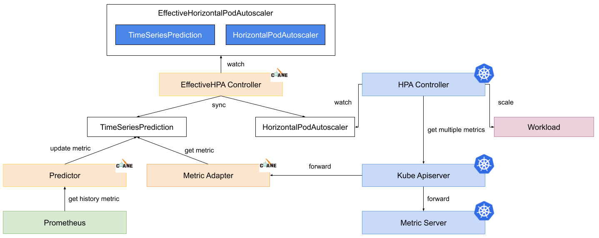
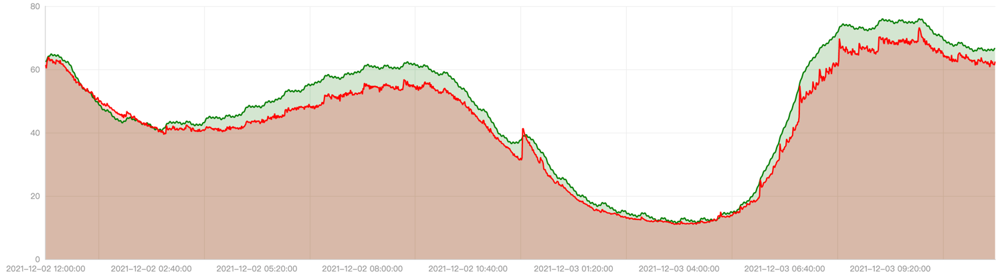
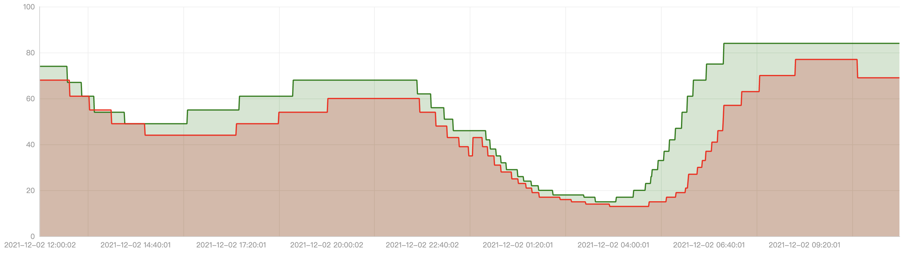
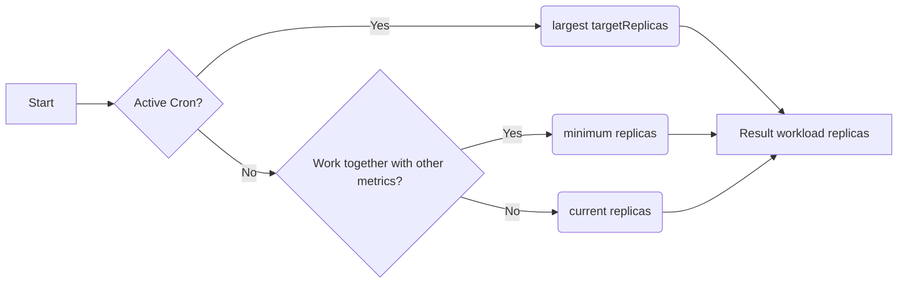

# EffectiveHorizontalPodAutoscaler

EffectiveHorizontalPodAutoscaler（简称 EHPA）是 Crane 提供的弹性伸缩产品，它基于社区 HPA 做底层的弹性控制，支持更丰富的弹性触发策略（预测，观测，周期），让弹性更加高效，并保障了服务的质量。
 
- 提前扩容，保证服务质量：通过算法预测未来的流量洪峰提前扩容，避免扩容不及时导致的雪崩和服务稳定性故障。
- 减少无效缩容：通过预测未来可减少不必要的缩容，稳定工作负载的资源使用率，消除突刺误判。
- 支持 Cron 配置：支持 Cron-based 弹性配置，应对大促等异常流量洪峰。
- 兼容社区：使用社区 HPA 作为弹性控制的执行层，能力完全兼容社区。

## 产品功能

一个简单的 EHPA yaml 文件如下：

```yaml
apiVersion: autoscaling.crane.io/v1alpha1
kind: EffectiveHorizontalPodAutoscaler
metadata:
  name: php-apache
spec:
  scaleTargetRef: #(1)
    apiVersion: apps/v1
    kind: Deployment
    name: php-apache
  minReplicas: 1 #(2)
  maxReplicas: 10 #(3)
  scaleStrategy: Auto #(4)
  metrics: #(5)
  - type: Resource
    resource:
      name: cpu
      target:
        type: Utilization
        averageUtilization: 50
  prediction: #(6)
    predictionWindowSeconds: 3600 #(7)
    predictionAlgorithm:
      algorithmType: dsp
      dsp:
        sampleInterval: "60s"
        historyLength: "3d"
```

1. ScaleTargetRef 配置你希望弹性的工作负载。
2. MinReplicas 指定了自动缩容的最小值。
3. MaxReplicas 指定了自动扩容的最大值。
4. ScaleStrategy 定义了弹性的策略，值可以是 "Auto" and "Preview".
5. Metrics 定义了弹性阈值配置。
6. Prediction 定义了预测算法配置。
7. PredictionWindowSeconds 指定往后预测多久的数据。

### 基于预测的弹性

大多数在线应用的负载都有周期性的特征。我们可以根据按天或者按周的趋势预测未来的负载。EHPA 使用 DSP 算法来预测应用未来的时间序列数据。

以下是一个开启了预测能力的 EHPA 模版例子：
```yaml
apiVersion: autoscaling.crane.io/v1alpha1
kind: EffectiveHorizontalPodAutoscaler
spec:
  prediction:
    predictionWindowSeconds: 3600
    predictionAlgorithm:
      algorithmType: dsp
      dsp:
        sampleInterval: "60s"
        historyLength: "3d"

```

#### 监控数据兜底

在使用预测算法预测时，你可能会担心预测数据不准带来一定的风险，EHPA 在计算副本数时，不仅会按预测数据计算，同时也会考虑实际监控数据来兜底，提升了弹性的安全性。
实现的原理是当你在 EHPA 中定义 `spec.metrics` 并且开启弹性预测时，EffectiveHPAController 会在创建底层管理的 HPA 时按策略自动生成多条 Metric Spec。

例如，当用户在 EHPA 的 yaml 里定义如下 Metric Spec：
```yaml
apiVersion: autoscaling.crane.io/v1alpha1
kind: EffectiveHorizontalPodAutoscaler
spec:
  metrics:
  - type: Resource
    resource:
      name: cpu
      target:
        type: Utilization
        averageUtilization: 50
```

它会自动转换成两条 HPA 的阈值配置：
```yaml
apiVersion: autoscaling/v2beta1
kind: HorizontalPodAutoscaler
spec:
  metrics:
    - pods:
        metric:
          name: crane_pod_cpu_usage
            selector:
              matchLabels:
                autoscaling.crane.io/effective-hpa-uid: f9b92249-eab9-4671-afe0-17925e5987b8
        target:
          type: AverageValue
          averageValue: 100m
      type: Pods
    - resource:
        name: cpu
        target:
          type: Utilization
          averageUtilization: 50
      type: Resource
```

在上面这个例子中，用户在 EHPA 创建的 Metric 阈值配置会自动转换成底层 HPA 上的两条 Metric 阈值配置：预测 Metric 阈值和实际监控 Metric 阈值

* **预测 Metric 阈值** 是一个 custom metric。值通过 Crane 的 MetricAdapter 提供。
* **实际监控 Metric 阈值**是一个 resource metric，它和用户在 EHPA 上定义的一样。这样 HPA 会根据应用实际监控的 Metric 计算副本数。

HPA 在配置了多个弹性 Metric 阈值时，在计算副本数时会分别计算每条 Metric 对应的副本数，并选择**最大**的那个副本数作为最终的推荐弹性结果。

#### 水平弹性的执行流程

1. EffectiveHPAController 创建 HorizontalPodAutoscaler 和 TimeSeriesPrediction 对象 
2. PredictionCore 从 prometheus 获取历史 metric 通过预测算法计算，将结果记录到 TimeSeriesPrediction
3. HPAController 通过 metric client 从 KubeApiServer 读取 metric 数据
4. KubeApiServer 将请求路由到 Crane 的 MetricAdapter。
5. HPAController 计算所有的 Metric 返回的结果得到最终的弹性副本推荐。
6. HPAController 调用 scale API 对目标应用扩/缩容。

整体流程图如下：


#### 用户案例
我们通过一个生产环境的客户案例来介绍 EHPA 的落地效果。

我们将生产上的数据在预发环境重放，对比使用 EHPA 和社区的 HPA 的弹性效果。

下图的红线是应用在一天内的实际 CPU 使用量曲线，我们可以看到在8点，12点，晚上8点时是使用高峰。绿线是 EHPA 预测的 CPU 使用量。


下图是对应的自动弹性的副本数曲线，红线是社区 HPA 的副本数曲线，绿线是 EHPA 的副本数曲线。


可以看到 EHPA 具有以下优势：

* 在流量洪峰来临前扩容。
* 当流量先降后立刻升时不做无效缩容。
* 相比 HPA 更少的弹性次数却更高效。

### ScaleStrategy 弹性策略
EHPA 提供了两种弹性策略：`Auto` 和 `Preview`。用户可以随时切换它并立即生效。

#### Auto
Auto 策略下 EHPA 会自动执行弹性行为。默认 EHPA 的策略是 Auto。在这个模式下 EHPA 会创建一个社区的 HPA 对象并自动接管它的生命周期。我们不建议用户修改或者控制这个底层的 HPA 对象，当 EHPA 被删除时，底层的 HPA 对象也会一并删除。

#### Preview
Preview 策略提供了一种让 EHPA 不自动执行弹性的能力。所以你可以通过 EHPA 的 desiredReplicas 字段观测 EHPA 计算出的副本数。用户可以随时在两个模式间切换，当用户切换到 Preview 模式时，用户可以通过 `spec.specificReplicas` 调整应用的副本数，如果 `spec.specificReplicas` 为空，则不会对应用执行弹性，但是依然会执行副本数的计算。

以下是一个配置成 Preview 模式的 EHPA 模版例子：
```yaml
apiVersion: autoscaling.crane.io/v1alpha1
kind: EffectiveHorizontalPodAutoscaler
spec:
  scaleStrategy: Preview   # ScaleStrategy indicate the strategy to scaling target, value can be "Auto" and "Preview".
  specificReplicas: 5      # SpecificReplicas specify the target replicas.
status:
  expectReplicas: 4        # expectReplicas is the calculated replicas that based on prediction metrics or spec.specificReplicas.
  currentReplicas: 4       # currentReplicas is actual replicas from target
```

### HorizontalPodAutoscaler 社区兼容
EHPA 从设计之出就希望和社区的 HPA 兼容，因为我们不希望重新造一个类似 HPA 的轮子，HPA 在不断演进的过程已经解决了很多通用的问题，EHPA 希望在 HPA 的基础上提供更高阶的 CRD，EHPA 的功能是社区 HPA 的超集。

EHPA 也会持续跟进支持 HPA 的新功能。

### EffectiveHorizontalPodAutoscaler status
EHPA 的 Status 包括了自身的 Status 同时也汇聚了底层 HPA 的部分 Status。

以下是一个 EHPA 的 Status yaml例子：
```yaml
apiVersion: autoscaling.crane.io/v1alpha1
kind: EffectiveHorizontalPodAutoscaler
status:
  conditions:                                               
  - lastTransitionTime: "2021-11-30T08:18:59Z"
    message: the HPA controller was able to get the target's current scale
    reason: SucceededGetScale
    status: "True"
    type: AbleToScale
  - lastTransitionTime: "2021-11-30T08:18:59Z"
    message: Effective HPA is ready
    reason: EffectiveHorizontalPodAutoscalerReady
    status: "True"
    type: Ready
  currentReplicas: 1
  expectReplicas: 0

```

### Cron-based autoscaling
EffectiveHorizontalPodAutoscaler 支持基于 cron 的自动缩放。

除了基于监控指标，有时节假日和工作日的工作负载流量存在差异，简单的预测算法可能效果不佳。然后可以通过设置周末 cron 来支持更大数量的副本来弥补预测的不足。

对于一些非 web 流量的应用，比如一些应用不需要在周末使用，可以把工作负载的副本数减少到 1，也可以配置 cron 来降低你的服务成本。

以下是 `EHPA Spec` 中的 cron 主要字段：

- `CronSpec`：可以设置多个 cron 自动伸缩配置，cron cycle 可以设置循环的开始时间和结束时间，并且工作负载的副本数可以在时间范围内持续保持为设定的目标值。
- `Name`：cron 标识符
- `TargetReplicas`：此 cron 时间范围内工作负载的目标副本数。
- `Start`：cron 的开始时间，标准 linux crontab 格式
- `End`：cron 的结束时间，标准 linux crontab 格式


一些云厂商和社区当前的 cron 自动缩放功能存在一些缺点。

1. cron 能力单独提供，没有在全局视图中进行自动缩放，与 HPA 兼容性差，与其他缩放触发器冲突。
2. cron 的语义和行为不是很匹配，使用时甚至很难理解，很容易误导用户，导致自动伸缩失败。

下图显示了当前 EHPA cron 自动伸缩实现与其他 cron 能力的对比。


针对以上问题，EHPA 实现的 cron autoscaling 是在与 HPA 兼容的基础上设计的，cron 作为 HPA 的一个指标，与其他指标一起作用于工作负载。

另外，cron 的设置也很简单。单独配置 cron 时，不在活动时间范围内时，不会对工作负载执行缩放。


#### Cron working without other metrics
假设你没有配置其他指标，你只需配置 cron 本身即可工作。
```yaml
apiVersion: autoscaling.crane.io/v1alpha1
kind: EffectiveHorizontalPodAutoscaler
metadata:
  name: php-apache-local
spec:
  # ScaleTargetRef 关联到需扩缩容的工作负载
  scaleTargetRef:
    apiVersion: apps/v1
    kind: Deployment
    name: php-apache
  minReplicas: 1        # MinReplicas : autoscaler 缩放的最低副本数
  maxReplicas: 100       # MaxReplicas : autoscaler 缩放的最大副本数 
  scaleStrategy: Auto   # ScaleStrategy : 缩放工作负载时候，所采用的策略。可选值为 "Auto" "Manual"
  # 最好将Cron Scheduling设置为一个完整的时间周期，例如： 一天，一周
  # 下面是一天的Cron Scheduling
  #(targetReplicas)
  #80                  --------     ---------        ----------
  #                    |       |    |        |       |         |
  #10       ------------       -----         --------          ----------
  #(time)   0 1 2 3 4 5 6 7 8 9 10 11 12 13 14 15 16 17 18 19 20 21 22 23
  #本地时区(timezone: "Local")意味着您使用运行Craned所在的服务器（或者可能是容器）的时区。例如，当Craned 是以UTC时区开始，那么它就是UTC。如果一开始是Asia/Shanghai，那么它就是Asia/Shanghai。
  crons:
    - name: "cron1"
      timezone: "Local"
      description: "scale down"
      start: "0 0 ? * *"
      end: "0 6 ? * *"
      targetReplicas: 10
    - name: "cron2"
      timezone: "Local"
      description: "scale up"
      start: "0 6 ? * *"
      end: "0 9 ? * *"
      targetReplicas: 80
    - name: "cron3"
      timezone: "Local"
      description: "scale down"
      start: "00 9 ? * *"
      end: "00 11 ? * *"
      targetReplicas: 10
    - name: "cron4"
      timezone: "Local"
      description: "scale up"
      start: "00 11 ? * *"
      end: "00 14 ? * *"
      targetReplicas: 80
    - name: "cron5"
      timezone: "Local"
      description: "scale down"
      start: "00 14 ? * *"
      end: "00 17 ? * *"
      targetReplicas: 10
    - name: "cron6"
      timezone: "Local"
      description: "scale up"
      start: "00 17 ? * *"
      end: "00 20 ? * *"
      targetReplicas: 80
    - name: "cron7"
      timezone: "Local"
      description: "scale down"
      start: "00 20 ? * *"
      end: "00 00 ? * *"
      targetReplicas: 10
``` 

CronSpec 具有以下字段:

* **name** 定义了 cron 的名字，cron 名字在同一个 Ehpa 中必须是唯一的
* **description** 定义 cron 的详细描述。它可以是空的。
* **timezone** 定义Crane所要调度的 cron 时区。如果未指定，则默认使用`UTC`时区。你可以将它设置为`Local`，这将使用正在运行的Crane容器所在的时区。其实，你定义`America/Los_Angeles`也是可以的。
* **start** 定义 cron 开始调度的时间，是 crontab 格式。参考 [wiki-Cron](https://en.wikipedia.org/wiki/Cron)
* **end** 定义 cron 结束调度的时间，是 crontab 格式。参考 [wiki-Cron](https://en.wikipedia.org/wiki/Cron)
* **targetReplicas** 定义目标副本在 cron 处于活动状态时要扩展的工作负载，这意味着目标副本数介于开始时间和结束时间之间生效。

以上YAML定义，意味着一天当中，工作负载在每小时所需要保持的副本数。工作负载将会每天按照该规则执行。

```
  #80                  --------     ---------        ----------
  #                    |       |    |        |       |         |
  #1        ------------       -----         --------          ----------
  #(time)   0 1 2 3 4 5 6 7 8 9 10 11 12 13 14 15 16 17 18 19 20 21 22 23
```

记住**不要设置开始时间在结束时间之后**。

例如，当你设置以下内容时：
```
  crons:
    - name: "cron2"
      timezone: "Local"
      description: "scale up"
      start: "0 9 ? * *"
      end: "0 6 ? * *"
      targetReplicas: 80
```
以上无效，因为开始总是晚于结束。

HPA 控制器始终根据工作负载所描述的副本数进行扩展，这意味着保留原有副本数不变。


#### Horizontal scaling process

cron 驱动和扩展过程有六个步骤：

1. `EffectiveHPAController` 创建 `HorizontalPodAutoscaler`，它被注入到`spec`中的`external cron metrics`中。
2. `HPAController` 从 `KubeApiServer` 读取 `external cron metrics`
3. `KubeApiServer` 将请求转发给 `MetricAdapter` 和 `MetricServer`
4. `MetricAdapter` 找到目标 hpa 的 `cron scaler`，并检测 `cron scaler` 是否处于活动状态。这意味着当前时间介于 cron 开始和结束计划时间之间。它将返回`TargetReplicas`中定义的`CronSpec`。
5. `HPAController` 计算所有 metrics 结果，并通过选择最大的一个为目标副本数。并由此创建一个新的`scale replicas`。
6. `HPAController` 使用 `Scale Api` 缩放目标


使用 EHPA 时，用户可以只配置 cron metric，让 EHPA 用作 cron hpa。

一个 EHPA 的多个 crons 将转换为一个`external metrics`。

HPA 将获取`external metrics`并在协调时计算目标副本。当存在多个指标的工作负载时，HPA 将选择最大的副本数来扩展。


#### Cron working with other metrics together

`EffectiveHorizontalPodAutoscaler` 兼容 `HorizontalPodAutoscaler`（内置在 kubernetes）。因此，如果你为 HPA 配置了指标，例如 cpu 或内存，那么 HPA 将根据它观察到的实时指标对副本数进行扩展。

通过 EHPA，用户可以同时配置 `CronMetric`、`PredictionMetric`、`OriginalMetric`。

**我们强烈建议你配置所有维度的指标。它们分别代表 cron 副本、先前预测的副本、后观察的副本。**

这是一个强大的功能。因为 HPA 总是选择由所有维度`metrics`计算的最大副本进行扩展。

这将保证你工作负载的 QoS，当你同时配置三种类型的自动缩放时，根据实际观察到的指标计算的副本最大，然后它将使用最大的一个。

尽管由于某些意想不到的原因，导致由`PredictionMetric`计算的副本更小。因此，你不必担心 QoS。


#### Mechanism
当`metrics adapter`处理`external cron metrics`请求时，`metrics adapter`将执行以下步骤。




1. 没有活跃的cron，有两种情况：

    - 没有其他 hpa 指标与 cron 一起使用，然后返回当前工作负载副本以保留原始所需的副本
    - 当其他 hpa 指标与 cron 一起使用，将会返回最小值以消除cron对其他指标的影响。当 cron 与其他指标一起工作时，它不应该返回工作负载的原始副本数，因为可能有其他指标想要缩小工作负载的副本数。`HPA Controller`选择由所有指标计算的最大副本（这是硬代码中的 hpa 默认策略)，cron 会影响 hpa。所以我们应该在 cron 不活动时移除 cron 效果，它应该返回最小值。


2. 有活跃的cron。我们使用`cron spec`中指定的最大目标副本。基本上，在同一时间段内不应有超过一个活跃的 cron，这不是最佳实践。

HPA 将获取`cron external metrics`，然后它会自行计算副本数。

#### Use Case

当你需要在午夜将工作负载副本数保持在最低限度，根据该需求配置了 cron。

你需要 HPA 来获取指标服务器观察到的真实指标，以根据实时观察到的指标进行扩展。

最后，你配置一个`prediction-driven metric`，通过预测方式提前扩大规模并在末期缩小规模。

```yaml
apiVersion: autoscaling.crane.io/v1alpha1
kind: EffectiveHorizontalPodAutoscaler
metadata:
  name: php-apache-multi-dimensions
spec:
  # ScaleTargetRef 关联到需扩缩容的工作负载
  scaleTargetRef:
    apiVersion: apps/v1
    kind: Deployment
    name: php-apache
  minReplicas: 1        # MinReplicas : 缩放的最小副本数
  maxReplicas: 100       # MaxReplicas : 缩放的最大副本数 
  scaleStrategy: Auto   # ScaleStrategy : 缩放工作负载时候，所采用的策略。可选值为 "Auto" "Manual"
  # Metrics 包含了用于计算所需副本数的指标。
  metrics:
    - type: Resource
      resource:
        name: cpu
        target:
          type: Utilization
          averageUtilization: 50
  # Prediction 的配置定义了需要预测的资源
  # 若不配置，则默认不启动 prediction
  prediction:
    predictionWindowSeconds: 3600   # PredictionWindowSeconds 是预测未来指标的时间窗口。
    predictionAlgorithm:
      algorithmType: dsp
      dsp:
        sampleInterval: "60s"
        historyLength: "3d"
  crons:
    - name: "cron1"
      description: "scale up"
      start: "0 0 ? * 6"
      end: "00 23 ? * 0"
      targetReplicas: 100
```


## 常见问题

### 错误: unable to get metric crane_pod_cpu_usage

当你查看 EffectiveHorizontalPodAutoscaler 的 Status 时，可以会看到这样的错误：

```yaml
- lastTransitionTime: "2022-05-15T14:05:43Z"
  message: 'the HPA was unable to compute the replica count: unable to get metric
    crane_pod_cpu_usage: unable to fetch metrics from custom metrics API: TimeSeriesPrediction
    is not ready. '
  reason: FailedGetPodsMetric
  status: "False"
  type: ScalingActive
```

原因：不是所有的工作负载的 CPU 使用率都是可预测的，当无法预测时就会显示以上错误。

解决方案：

- 等一段时间再看。预测算法 `DSP` 需要一定时间的数据才能进行预测。希望了解算法细节的可以查看算法的文档。
- EffectiveHorizontalPodAutoscaler 提供一种保护机制，当预测失效时依然能通过实际的 CPU 使用率工作。
