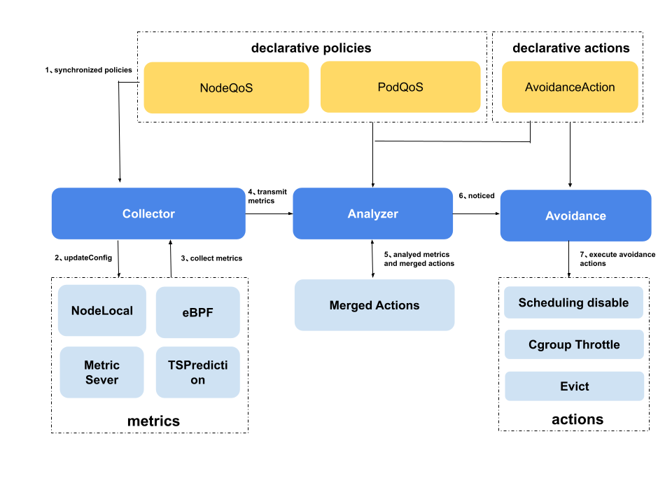

# Qos Ensurance
QoS ensurance guarantees the stability of the pods running on Kubernetes.

It has the ability of interference detection and active avoidance. When pod with higher priority is affected by resource competition, disable schedule, throttle and evict will be applied to pod with lower priority to support interference detection and user-defined operation of user-defined indicators;

At the same time, it has enhanced bypass cpuset management capability to improve resource utilization efficiency while binding cores.

It has the dynamic resource oversold ability enhanced by the prediction algorithm, and reuses the idle resources. At the same time, it combines the prediction ability of the crane to better reuse the idle resources. At the same time, it has the elastic resource limitation function to limit the workload of reusing idle resources.

## Qos Ensurance Architecture
Qos ensurance's architecture is shown as below. It contains three modules.

1. state collector: collect metrics periodically
2. anomaly analyzer: analyze the node triggered anomaly used collected metrics
3. action executor: execute avoidance actions, include disable scheduling, throttle and eviction.



The main process:

1. State collector synchronizes policies from kube-apiserver.
2. If the policies are changed, the state collector updates the collectors.
3. State collector collects metrics periodically.
4. State collector transmits metrics to anomaly analyzer.
5. Anomaly analyzer ranges all rules to analyze the avoidance threshold or the restored threshold reached.
6. Anomaly analyzer merges the analyzed results and notices the avoidance actions.
7. Action executor executes actions based on the analyzed results.

## Interference Detection and Active Avoidance
### Disable Scheduling

The following AvoidanceAction and NodeQOSEnsurancePolicy can be defined. As a result, when the node CPU usage triggers the threshold, disable schedule action for the node will be executed.

The sample YAML looks like below:

```yaml
apiVersion: ensurance.crane.io/v1alpha1
kind: AvoidanceAction
metadata:
  labels:
    app: system
  name: disablescheduling
spec:
  description: disable schedule new pods to the node
  coolDownSeconds: 300  # The minimum wait time of the node from  scheduling disable status to normal status
```

```yaml
apiVersion: ensurance.crane.io/v1alpha1
kind: NodeQOSEnsurancePolicy
metadata:
  name: "waterline1"
  labels:
    app: "system"
spec:
  nodeQualityProbe: 
    timeoutSeconds: 10
    nodeLocalGet:
      localCacheTTLSeconds: 60
  objectiveEnsurances:
  - name: "cpu-usage"
    avoidanceThreshold: 2 #(1) 
    restoreThreshold: 2 #(2)
    actionName: "disablescheduling" #(3) 
    strategy: "None" #(4) 
    metricRule:
      name: "cpu_total_usage" #(5) 
      value: 4000 #(6) 
```

1. We consider the rule is triggered, when the threshold reached continued so many times
2. We consider the rule is restored, when the threshold not reached continued so many times
3. Name of AvoidanceAction which be associated
4. Strategy for the action, you can set it "Preview" to not perform actually
5. Name of metric
6. Threshold of metric

Please check the video to learn more about the scheduling disable actions.

<script id="asciicast-480735" src="https://asciinema.org/a/480735.js" async></script>

### Throttle

The following AvoidanceAction and NodeQOSEnsurancePolicy can be defined. As a result, when the node CPU usage triggers the threshold, throttle action for the node will be executed.

The sample YAML looks like below:

```yaml
apiVersion: ensurance.crane.io/v1alpha1
kind: AvoidanceAction
metadata:
  name: throttle
  labels:
    app: system
spec:
  coolDownSeconds: 300
  throttle:
    cpuThrottle:
      minCPURatio: 10 #(1)
      stepCPURatio: 10 #(2) 
  description: "throttle low priority pods"
```

1. The minimal ratio of the CPU quota, if the pod is throttled lower than this ratio, it will be set to this.
2. The step for throttle action. It will reduce this percentage of CPU quota in each avoidance triggered.It will increase this percentage of CPU quota in each restored.

```yaml
apiVersion: ensurance.crane.io/v1alpha1
kind: NodeQOSEnsurancePolicy
metadata:
  name: "waterline2"
  labels:
    app: "system"
spec:
  nodeQualityProbe:
    timeoutSeconds: 10
    nodeLocalGet:
      localCacheTTLSeconds: 60
  objectiveEnsurances:
    - name: "cpu-usage"
      avoidanceThreshold: 2
      restoredThreshold: 2
      actionName: "throttle"
      strategy: "None"
      metricRule:
        name: "cpu_total_usage"
        value: 6000
```

### Eviction

The following YAML is another case, low priority pods on the node will be evicted, when the node CPU usage trigger the threshold.

```yaml
apiVersion: ensurance.crane.io/v1alpha1
kind: AvoidanceAction
metadata:
  name: eviction
  labels:
    app: system
spec:
  coolDownSeconds: 300
  eviction:
    terminationGracePeriodSeconds: 30 #(1) 
  description: "evict low priority pods"
```

1. Duration in seconds the pod needs to terminate gracefully.

```yaml
apiVersion: ensurance.crane.io/v1alpha1
kind: NodeQOSEnsurancePolicy
metadata:
  name: "waterline3"
  labels:
    app: "system"
spec:
  nodeQualityProbe: 
    timeoutSeconds: 10
    nodeLocalGet:
      localCacheTTLSeconds: 60
  objectiveEnsurances:
  - name: "cpu-usage"
    avoidanceThreshold: 2
    restoreThreshold: 2
    actionName: "eviction"
    strategy: "Preview" #(1) 
    metricRule:
      name: "cpu_total_usage"
      value: 6000
```

1. Strategy for the action, "Preview" to not perform actually

### Supported Metrics

Name     | Description
---------|-------------
cpu_total_usage | node cpu usage
cpu_total_utilization | node cpu utilization

### Accurately Perform Avoidance Actions
Through the following two points, the excessive operation of low-quality pod can be avoided, and the gap between the metrics and the specified waterline can be reduced faster, so as to ensure that the high-priority service is not affected
1. Sort pod

Crane implements some general sorting methods (which will be improved later):

ClassAndPriority: compare the QOSClass and class value of two pods, compare QOSClass first, and then class value; Those with high priority are ranked later and have higher priority

runningTime: compare the running time of two pods. The one with long running time is ranked later and has higher priority
    
If you only need to use these two sorting strategies, you can use the default sorting method: you will first compare the priority of the pod, then compare the consumption of the corresponding indicators of the pod, and then compare the running time of the pod. There is a dimension that can compare the results, that is, the sorting results of the pod

Taking the ranking of CPU usage metric as an example, it also extends some ranking strategies related to its own metric, such as the ranking of CPU usage, which will compare the priority of two pods in turn. If the priority is the same, then compare the CPU consumption. If the CPU consumption is also the same, continue to compare the extended CPU resource consumption, and finally compare the running time of pod, when there is a difference in an indicator, the comparison result can be returned: `orderedby (classandpriority, CpuUsage, extcpuusage, runningtime) Sort(pods)`

2. Refer to the waterline and pod usage to perform avoidance action
```go
//Divide all the metrics that trigger the waterline threshold into two parts according to their quantified attribute
metricsQuantified, MetricsNotQuantified := ThrottleDownWaterLine.DivideMetricsByQuantified()
// If there is a metric that cannot be quantified, obtain the metric of a throttleable with the highest actionpriority to operate on all selected pods
if len(MetricsNotThrottleQuantified) != 0 {
    highestPrioriyMetric := GetHighestPriorityThrottleAbleMetric()
    t.throttlePods(ctx, &totalReleased, highestPrioriyMetric)
} else {
    //Get the latest usage, get the gap to waterline
    ThrottoleDownGapToWaterLines = buildGapToWaterLine(ctx.getStateFunc())
    //If the real-time consumption of metric in the trigger waterline threshold cannot be obtained, chose the metric which is throttleable with the highest actionpriority to suppress all selected pods
    if ThrottoleDownGapToWaterLines.HasUsageMissedMetric() {
        highestPrioriyMetric := ThrottleDownWaterLine.GetHighestPriorityThrottleAbleMetric()
        errPodKeys = throttlePods(ctx, &totalReleased, highestPrioriyMetric)
    } else {
        var released ReleaseResource
        //Traverse the quantifiable metrics in the metrics that trigger the waterline: if the metric has a sorting method, use its sortfunc to sort the pod directly, 
        //otherwise use generalsorter to sort; Then use its corresponding operation method to operate the pod, and calculate the amount of resources released from the corresponding metric until the gap between the corresponding metric and the waterline no longer exists
        for _, m := range metricsQuantified {
            if m.SortAble {
                m.SortFunc(ThrottleDownPods)
            } else {
                GeneralSorter(ThrottleDownPods)
            }
    
            for !ThrottoleDownGapToWaterLines.TargetGapsRemoved(m) {
                for index, _ := range ThrottleDownPods {
                    released = m.ThrottleFunc(ctx, index, ThrottleDownPods, &totalReleased)
                    ThrottoleDownGapToWaterLines[m] -= released[m]
                }
            }
        }
    }
}
```
About extending user-defined metrics and sorting, it is introduced in "User-defined metrics interference detection avoidance and user-defined sorting".

## Enhanced bypass cpuset management capability
Kubelet supports the static CPU manager strategy. When the guaranteed pod runs on the node, kebelet will allocate the specified dedicated CPU for the pod, which cannot be occupied by other processes. This ensures the CPU monopoly of the guaranteed pod, but also causes the low utilization of CPU and nodes, resulting in a certain waste.
Crane agent provides a new strategy for cpuset management, allowing pod and other pod to share CPU. When it specifies CPU binding core, it can make use of the advantages of less context switching and higher cache affinity of binding core, and also allow other workload to deploy and share, so as to improve resource utilization.

1. Three types of pod cpuset are provided:

- Exclusive: after binding the core, other containers can no longer use the CPU and monopolize the CPU
- Share: other containers can use the CPU after binding the core
- None: select the CPU that is not occupied by the container of exclusive pod, can use the binding core of share type

Share type binding strategy can make use of the advantages of less context switching and higher cache affinity, and can also be shared by other workload deployments to improve resource utilization

2. Relax the restrictions on binding cores in kubelet

Originally, it was required that the CPU limit of all containers be equal to the CPU request. Here, it is only required that the CPU limit of any container be greater than or equal to 1 and equal to the CPU request to set the binding core for the container


3. Support modifying the cpuset policy of pod during the running of pod, which will take effect immediately

The CPU manager policy of pod is converted from none to share and from exclusive to share without restart

How to use:
1. Set the cpuset manager of kubelet to "None"
2. Set CPU manager policy through pod annotation
   `qos.gocrane.io/cpu-manager: none/exclusive/share`
   ```yaml
   apiVersion: v1
   kind: Pod
   metadata:
     annotations:
       qos.gocrane.io/cpu-manager: none/exclusive/share
   ```

## Dynamic resource oversold enhanced by prediction algorithm
In order to improve the stability, users usually set the request value higher than the actual usage when deploying applications, resulting in a waste of resources. In order to improve the resource utilization of nodes, users will deploy some besteffort applications in combination, using idle resources to realize oversold;
However, due to the lack of resource limit and request constraints and related information in these applications, scheduler may still schedule these pods to nodes with high load, which is inconsistent with our original intention, so it is best to schedule based on the free resources of nodes.

Crane collects the idle resources of nodes in the following two ways, and takes them as the idle resources of nodes after synthesis, which enhances the accuracy of resource evaluation:

1. CPU usage information collected locally

`nodeCpuCannotBeReclaimed := nodeCpuUsageTotal + exclusiveCPUIdle - extResContainerCpuUsageTotal`  

ExclusiveCPUIdle refers to the idle amount of CPU occupied by the pod whose CPU manager policy is exclusive. Although this part of resources is idle, it cannot be reused because of monopoly, so it is counted as used

ExtResContainerCpuUsageTotal refers to the CPU consumption used as dynamic resources, which needs to be subtracted to avoid secondary calculation

2. Create a TSP of node CPU usage, which is automatically created by default, and will predict node CPU usage based on history
```yaml
apiVersion: v1
data:
  spec: |
    predictionMetrics:
    - algorithm:
        algorithmType: dsp
        dsp:
          estimators:
            fft:
            - highFrequencyThreshold: "0.05"
              lowAmplitudeThreshold: "1.0"
              marginFraction: "0.2"
              maxNumOfSpectrumItems: 20
              minNumOfSpectrumItems: 10
          historyLength: 3d
          sampleInterval: 60s
      resourceIdentifier: cpu
      type: ExpressionQuery
      expressionQuery:
        expression: 'sum(count(node_cpu_seconds_total{mode="idle",instance=~"({{.metadata.name}})(:\\d+)?"}) by (mode, cpu)) - sum(irate(node_cpu_seconds_total{mode="idle",instance=~"({{.metadata.name}})(:\\d+)?"}[5m]))'
    predictionWindowSeconds: 3600
kind: ConfigMap
metadata:
  name: noderesource-tsp-template
  namespace: default
```

Combine the prediction algorithm with the current actual consumption to calculate the remaining available resources of the node, and give it to the node as an extended resource. Pod can indicate that the extended resource is used as an offline job to use the idle resources, so as to improve the resource utilization rate of the node;

How to use:
When deploying pod, limit and request use `gocrane.io/<$resourcename>:<$value>`, as follows
```yaml
spec: 
   containers:
   - image: nginx
     imagePullPolicy: Always
     name: extended-resource-demo-ctr
     resources:
       limits:
         gocrane.io/cpu: "2"
       requests:
         gocrane.io/cpu: "2"
```

## Elastic resource restriction function
The native besteffort application lacks a fair guarantee of resource usage. Crane guarantees that the CPU usage of the besteffort pod using dynamic resources is limited within the reasonable range of its allowable use. The agent guarantees that the actual consumption of the pod using extended resources will not exceed its stated limit. At the same time, when the CPU competes, it can also compete fairly according to its stated amount; At the same time, pod using elastic resources will also be managed by the waterline function.

How to use:
When deploying pod, limit and request use `gocrane.io/<$resourcename>:<$value>`

## User-defined metrics interference detection avoidance and user-defined sorting
The use of user-defined metrics interference detection avoidance and user-defined sorting is the same as the process described in the "Accurately Perform Avoidance Actions". Here is how to customize your own metrics to participate in the interference detection avoidance process

In order to better sort and accurately control metrics configured based on NodeQoSEnsurancePolicy, the concept of attributes is introduced into metrics.

The attributes of metric include the following, and these fields can be realized by customized indicators:

1. Name Indicates the name of metric, which should be consistent with the metric name collected in the collector module
2. ActionPriority Indicates the priority of the metric. 0 is the lowest and 10 is the highest
3. SortAble Indicates whether the metric can be sorted. If it is true, the corresponding SortFunc needs to be implemented
4. SortFunc The corresponding sorting method. The sorting method can be arranged and combined with some general methods, and then combined with the sorting of the metric itself, which will be introduced in detail below
5. ThrottleAble Indicates whether pod can be suppressed for this metric. For example, for the metric of CPU usage, there are corresponding suppression methods, but for the metric of memory usage, pod can only be evicted, and effective suppression cannot be carried out
6. ThrottleQuantified Indicates whether the amount of resources corresponding to metric released after suppressing (restoring) a pod can be accurately calculated. We call the metric that can be accurately quantified as quantifiable, otherwise it is not quantifiable;
   For example, the CPU usage can be suppressed by limiting the CGroup usage, and the CPU usage released after suppression can be calculated by the current running value and the value after suppression; Memory usage does not belong to suppression quantifiable metric, because memory has no corresponding throttle implementation, so it is impossible to accurately measure the specific amount of memory resources released after suppressing a pod;
7. ThrottleFunc The specific method of executing throttle action. If throttle is not available, the returned released is null
8. RestoreFunc After being throttled, the specific method of performing the recovery action. If restore is not allowed, the returned released is null
9. Evictable, EvictQuantified and EvictFunc The relevant definitions of evict action are similar to those of throttle action

```go
type metric struct {
	Name WaterLineMetric

	ActionPriority int

	SortAble bool
	SortFunc func(pods []podinfo.PodContext)

	ThrottleAble      bool
	ThrottleQuantified bool
	ThrottleFunc      func(ctx *ExecuteContext, index int, ThrottleDownPods ThrottlePods, totalReleasedResource *ReleaseResource) (errPodKeys []string, released ReleaseResource)
	RestoreFunc       func(ctx *ExecuteContext, index int, ThrottleUpPods ThrottlePods, totalReleasedResource *ReleaseResource) (errPodKeys []string, released ReleaseResource)

	EvictAble      bool
	EvictQuantified bool
	EvictFunc      func(wg *sync.WaitGroup, ctx *ExecuteContext, index int, totalReleasedResource *ReleaseResource, EvictPods EvictPods) (errPodKeys []string, released ReleaseResource)
}
```

After the construction is completed, register the metric through registerMetricMap()

For the metrics that need to be customized, you can easily realize the flexible customized sorting of pod by combining the following methods with general sorting methods to represent the customized metric indicators, <metric-sort-func> represents the customized sorting strategy

```yaml
func <metric>Sorter(pods []podinfo.PodContext) {
  orderedBy(classAndPriority, <metric-sort-func>, runningTime).Sort(pods)
}
```
Among them, the following sorting method `<metric-sort-func>` needs to be implemented
`func (p1, p2 podinfo.PodContext) int32` 